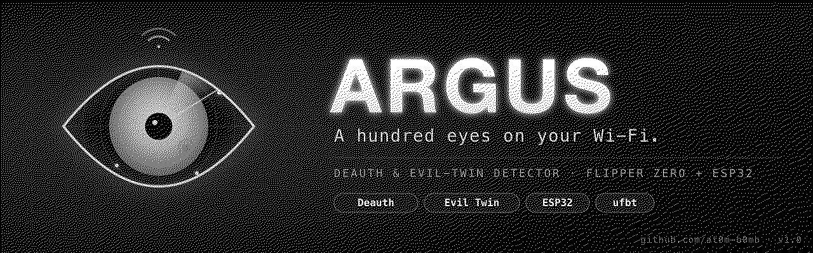
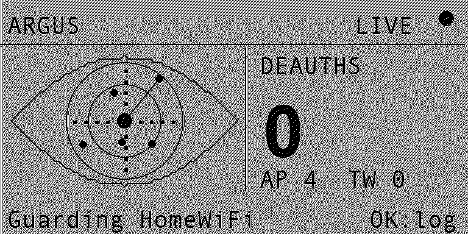
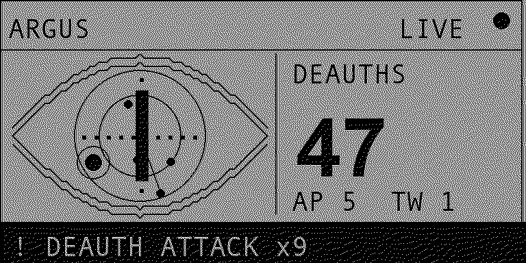
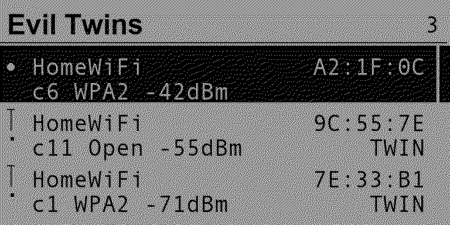
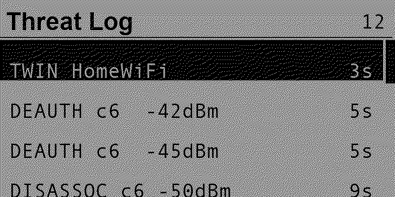
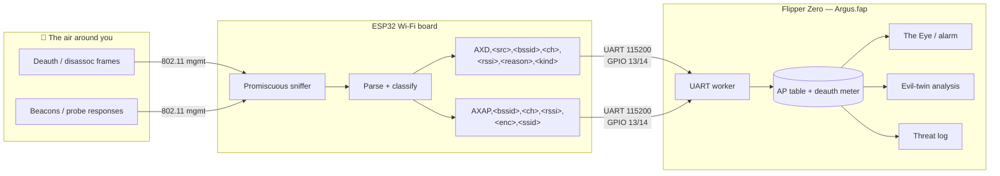

<!-- banner -->
<p align="center">
  
</p>

<h1 align="center">Argus 👁️</h1>
<p align="center"><i>A hundred eyes on your Wi-Fi.</i></p>

<p align="center">
  
  
  
  
</p>

<p align="center">
  <b>Argus</b> turns your Flipper Zero into a <b>Wi-Fi watchdog</b>. Paired with a cheap ESP32 board over
  GPIO, it watches the air for <b>deauthentication / disassociation attacks</b> and for <b>rogue "evil-twin"
  access points</b> cloning <i>your</i> network's SSID — and it sounds the alarm the moment someone starts
  swinging at your network.
</p>

<p align="center"><sub>Named after <b>Argus Panoptes</b>, the hundred-eyed giant of Greek myth who never slept and saw everything.</sub></p>

---

## 📟 On the Flipper

<p align="center">
  
  &nbsp;
  
  &nbsp;
  
  &nbsp;
  
</p>
<p align="center">
  <sub><b>The Eye</b> — live watch &nbsp;·&nbsp; <b>Alarm</b> — deauth storm detected &nbsp;·&nbsp; <b>Evil Twins</b> — clones of your SSID &nbsp;·&nbsp; <b>Threat Log</b> — timeline of events</sub>
</p>

---

## ✨ Features

- 👁️ **The Eye** — a beautiful animated radar-iris that sweeps while it watches. Calm when all is well; the pupil narrows and the screen frames itself in an **alarm border** under attack.
- 💥 **Deauth / disassoc detection** — counts hostile management frames and measures their **rate**. A burst past your threshold = a *deauth storm*, and Argus screams (sound + vibe + red LED).
- 👯 **Evil-twin detection** — set your network as the **Guarded SSID**; Argus flags any *other* BSSID broadcasting that same name (the classic rogue-AP / Wi-Fi-pineapple trick), and highlights **security downgrades** (e.g. your WPA2 network suddenly appearing as *Open*).
- 📜 **Threat log** — a scrollable, timestamped timeline of every deauth, disassoc and twin sighting.
- 🎚️ **Tunable** — lock to one channel or hop all 13, pick alarm sensitivity (High / Medium / Low), toggle sound / vibration / LED independently.
- 🔌 **Clean ESP32 protocol** — a simple, debuggable UART line protocol. The **Flipper is the brain + UI**, the **ESP32 is the radio**.
- 🕶️ **Local & private** — everything runs on your own hardware. No cloud, no accounts, nothing phones home.

---

## 🧠 How it works

The Flipper Zero has **no Wi-Fi radio of its own** (it does Sub-GHz, NFC, RFID, IR and BLE — not 2.4 GHz Wi-Fi).
So Argus splits the job: a tiny **ESP32 is the Wi-Fi radio** running in *promiscuous (monitor) mode*, and the
**Flipper is the brain + UI**. They talk over the GPIO UART.



**Evil-twin logic:** Argus keeps a table of every AP it hears. For your Guarded SSID, the strongest signal is
assumed to be your real router; **any other BSSID broadcasting the same SSID is flagged as a twin** — doubly so
if it advertises weaker security than your real AP.

---

## 🧰 Hardware you need

| Item | Notes |
|------|-------|
| **Flipper Zero** | running official or a custom firmware |
| **ESP32 board** | the official [**Flipper Wi-Fi devboard (ESP32-S2)**](https://shop.flipperzero.one/products/wifi-devboard) is plug-and-play. Any ESP32 / ESP32-S2 / ESP32-S3 dev board also works with a few jumper wires. |
| **3 jumper wires** | only if you're using a bare ESP32 (the devboard needs none) |

### Wiring (bare ESP32 → Flipper GPIO)

> Using the official Flipper Wi-Fi devboard? **Skip this** — just snap it onto the GPIO header.

| Flipper pin | ESP32 pin | Direction |
|-------------|-----------|-----------|
| `13` TX | `RX` (RX0) | Flipper → ESP32 |
| `14` RX | `TX` (TX0) | ESP32 → Flipper |
| `8` / `11` / `18` GND | `GND` | common ground |
| `9` 3V3 | `3V3` | power *(or just power the ESP32 from USB)* |

<sub>Flipper GPIO pinout: [docs.flipper.net/gpio-and-modules](https://docs.flipper.net/gpio-and-modules). TX↔RX are crossed — the Flipper's TX goes to the ESP32's RX and vice-versa.</sub>

---

## 🚀 Install

There are two halves: flash the **ESP32 firmware**, then install the **Flipper app**.

### 1 — Flash the ESP32

1. Install the [Arduino IDE](https://www.arduino.cc/en/software) and add ESP32 support:
   **File → Preferences → Additional Boards Manager URLs** →
   `https://raw.githubusercontent.com/espressif/arduino-esp32/gh-pages/package_esp32_index.json`
   then **Tools → Board → Boards Manager → "esp32" → Install**.
2. Open [`esp32/argus_esp32/argus_esp32.ino`](esp32/argus_esp32/argus_esp32.ino).
3. Select your board under **Tools → Board** (e.g. *ESP32S2 Dev Module* for the Flipper devboard) and the right **Port**.
4. Click **Upload**. No external libraries are required — it uses the built-in `esp_wifi` driver.

> 💡 Verify it works: open the Arduino **Serial Monitor** at **115200 baud**. You should see `AXHELLO,1.0`
> on boot and a stream of `AXAP,...` / `AXD,...` lines as it sniffs.

### 2 — Install the Flipper app

**Option A — prebuilt `.fap` (easiest)**

1. Grab `argus.fap` from the [**Releases**](https://github.com/at0m-b0mb/Argus-FlipperZero/releases) page.
2. Open **qFlipper**, drag the file onto `SD Card / apps / GPIO /`.
3. On the Flipper: **Apps → GPIO → Argus**.

**Option B — build it yourself with [`ufbt`](https://github.com/flipperdevices/flipperzero-ufbt)**

```bash
# one-time
python3 -m pip install --upgrade ufbt

# from the repo root, with your Flipper plugged in over USB:
ufbt            # build argus.fap into ./dist
ufbt launch     # build, upload to the Flipper and open it
```

The `.fap` lands in `dist/argus.fap`; `ufbt launch` copies it to `apps/GPIO/` and starts it for you.

> Icons in `icons/` and screenshots in `images/` are generated — regenerate with
> `python3 tools_gen_icons.py` and `python3 tools_gen_mockups.py` (needs `pillow`).

---

## 🎮 Using it

1. Plug the ESP32 into the Flipper's GPIO and launch **Argus**.
2. **Guarded SSID** → type your own network's name. (This is what evil-twin detection compares against.)
3. **Settings** → choose channel mode (start with **Hop**), alarm sensitivity and feedback.
4. **Watch** → arm the Eye. The header shows **LIVE** with a filled dot once the ESP32 is talking.
   - All quiet → the iris sweeps calmly, blips are nearby APs.
   - Under attack → the pupil narrows, the screen frames in an alarm border, and `! DEAUTH ATTACK` flashes with the live rate.
   - Press **OK** to jump straight to the **Threat Log**.
5. **Evil Twin Scan** → list every AP carrying your SSID. Your real router shows a `•`; impostors are marked **TWIN**.

Leaving a screen back to the menu disarms the radio and frees the UART.

---

## 🔌 Wire protocol

Plain newline-terminated ASCII at **115200 8N1**. SSIDs are sanitised to strip commas/control chars.

**ESP32 → Flipper**

| Line | Meaning |
|------|---------|
| `AXHELLO,<ver>` | sent on boot / on `PING` |
| `AXD,<src>,<bssid>,<ch>,<rssi>,<reason>,<kind>` | deauth (`kind=0`) / disassoc (`kind=1`) frame |
| `AXAP,<bssid>,<ch>,<rssi>,<enc>,<ssid>` | a beacon / probe-response (`enc`: 0 Open · 1 WEP · 2 WPA · 3 WPA2 · 4 WPA3) |

**Flipper → ESP32**

| Command | Meaning |
|---------|---------|
| `START` / `STOP` | begin / pause sniffing |
| `CHAN:<0-13>` | `0` = hop all channels, `1..13` = lock to that channel |
| `GUARD:<ssid>` | inform the board which SSID you're protecting |
| `PING` | ask the board to re-announce `AXHELLO` |

---

## 🗂️ Project layout

```
Argus-FlipperZero/
├── application.fam            # Flipper app manifest
├── argus.c / argus_i.h        # app entry, wiring, alarm logic
├── helpers/
│   ├── argus_db.{c,h}         # AP table, deauth meter, evil-twin analysis
│   └── uart_link.{c,h}        # ESP32 serial link (worker thread + parser)
├── views/
│   ├── monitor_view.{c,h}     # "The Eye" — the live watch screen
│   ├── ap_list_view.{c,h}     # evil-twin / AP list
│   └── threat_log_view.{c,h}  # event timeline
├── scenes/                    # scene-manager navigation
├── icons/                     # 1-bit Flipper icons (generated)
├── images/                    # banner + screen mockups (generated)
├── esp32/argus_esp32/         # ESP32 promiscuous-sniffer firmware
└── tools_gen_*.py             # regenerate icons / mockups
```

---

## 🔬 Honest limitations

- It detects deauth **floods**, not single surgical frames — a couple of stray deauths are normal Wi-Fi life; Argus alarms on a *rate*, which you tune.
- Evil-twin detection is heuristic: "same SSID, different BSSID (+ weaker crypto)". A legitimate mesh/extender that reuses your SSID on a different BSSID can show up — that's working as intended; you confirm which BSSID is yours.
- 2.4 GHz only (channels 1–13) — the ESP32's radio doesn't do 5 GHz.
- While hopping channels the ESP32 only hears one channel at a time, so a very short burst on another channel can be missed. Lock the channel for focused monitoring.

---

## ⚖️ Legal & ethical

Argus is a **defensive** tool — it only **listens**. It never transmits, deauths or jams anything.
Use it to monitor **networks you own or are explicitly authorised to test**. Passively capturing frames
may still be regulated where you live; know your local laws. You are responsible for how you use it.

---

## 🗺️ Roadmap

- [ ] Persist the Guarded SSID + settings across reboots
- [ ] "Trust this BSSID" pinning so known extenders stop flagging
- [ ] Capture-to-file (`.csv`) of the threat log on the SD card
- [ ] Per-AP detail screen (vendor OUI lookup, first/last seen)
- [ ] Optional 5 GHz via an ESP32-C5 board

---

## 🙏 Credits

- Built by **[at0m-b0mb](https://github.com/at0m-b0mb)**.
- Pairs naturally with **[AirDriver](https://github.com/at0m-b0mb/AirDriver)** (Wi-Fi adapter driver auto-installer) and **[GhostTag](https://github.com/at0m-b0mb/GhostTag-FlipperZero)** (BLE anti-stalking hunter).
- Powered by the [Flipper Zero firmware](https://github.com/flipperdevices/flipperzero-firmware) + [ufbt](https://github.com/flipperdevices/flipperzero-ufbt) and Espressif's `esp_wifi`.

## 📄 License

[MIT](LICENSE) © 2026 at0m-b0mb
