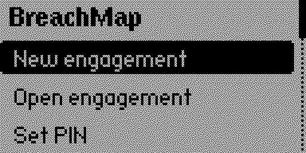
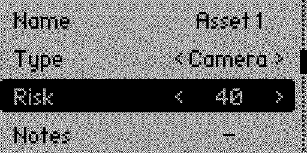
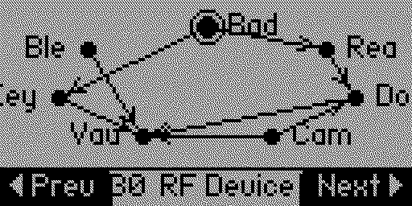
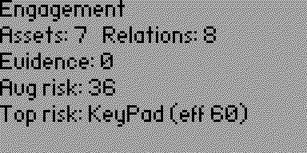

# 🗺️ BreachMap

**Map the path from badge to breach — a physical security reconnaissance notebook
that runs on your Flipper Zero.**

Your physical pentest engagements deserve better than a scratchpad of notes and a
pile of loose `.sub` and `.nfc` files. BreachMap turns your Flipper into a
field notebook for **authorized** physical security assessments — capture what you
see, link the evidence, map how everything connects, and walk away with a clean
report.

> Think *Obsidian* for physical pentesters, *Dradis* in your pocket, and a
> lightweight *BloodHound* concept for doors, readers and cameras.

**This is not an attack tool.** It doesn't unlock, clone or transmit anything. It
helps you *collect, organize and analyze* observations during engagements you are
authorized to run.

<p align="center">
  
  
  
  
</p>

---

## Why it exists

On a physical assessment you're juggling a dozen observations at once: which reader
controls which door, where the cameras cover, which badge you saw at the loading
bay, what frequency that gate remote used. By the time you sit down to write the
report, half the context is gone.

BreachMap keeps that context **on the device, as you walk**, and structures it
so the report writes itself.

## Features

- 📁 **Engagements** — self-contained audit sessions with client and location
  metadata, saved to the SD card and reopened anytime.
- 🎯 **Assets** — record doors, RFID readers, cameras, BLE devices, RF devices and
  unknown targets. Each carries a type, a **risk score (0–100)** and free notes.
- 🧾 **Evidence** — link real capture files with the native file browser and
  auto-extract metadata (frequency/preset from `.sub`, device type/UID from `.nfc`),
  or quick-import the latest capture from your SubGHz/NFC folders.
- 🕸️ **Relationship graph** — model directed relations between assets
  (`Badge → Reader → Door → Camera`) and see the whole picture on an on-device node
  graph with labels and directional arrows. Drag nodes into a floorplan layout.
- 🎯 **Attack path** — the graph highlights the riskiest chain to your
  highest-value asset, BloodHound-style.
- 📈 **Risk propagation** — risk flows along access and control edges, so a weak
  reader automatically raises the *effective* risk of the door it controls.
- 🚩 **Findings** — set a severity and remediation per asset; the Markdown report
  opens with an executive summary ranked by severity.
- 📊 **Risk summary** — a per-engagement dashboard with counts, average risk and
  the highest effective-risk asset.
- 📤 **Reports** — export the whole engagement as machine-readable **JSON** or a
  human-readable **Markdown** report, straight to the SD card.
- 🔒 **Screen lock** — optional PIN gate for casual protection of your notes.
- 💾 **100% offline & local** — no companion app, no cloud, no radios used. Your
  findings never leave the SD card.

## Quick start

1. Install from the **Flipper Apps Catalog** (`Apps → Tools → BreachMap`), or
   build it yourself (see below).
2. Open the app and choose **New engagement**.
3. Add assets, set their type / risk / notes, and attach evidence.
4. Link assets with relations, then open **Graph** to visualize them.
5. **Save**, then **Export JSON / Markdown** to `/ext/apps_data/breach_map/`.

## Where your data lives

Everything is stored on the SD card under `/ext/apps_data/breach_map/`:

| Path | Contents |
| --- | --- |
| `sessions/<name>.recon` | Engagement data (Flipper file format) |
| `exports/<name>.json` | JSON export (machine-readable) |
| `exports/<name>.md` | Markdown report (human-readable) |

### Example JSON export

```json
{
  "tool": "BreachMap",
  "name": "Engagement",
  "assets": [
    {"id": 1, "type": "RF Device", "risk": 30, "name": "Badge", "evidence": []},
    {"id": 2, "type": "RFID Reader", "risk": 55, "name": "Front Reader", "evidence": []},
    {"id": 3, "type": "Door", "risk": 25, "name": "Front Door", "evidence": []}
  ],
  "relations": [
    {"from": 1, "to": 2, "type": "reads badge"},
    {"from": 2, "to": 3, "type": "controls"}
  ]
}
```

## Building from source

Built with [uFBT](https://pypi.org/project/ufbt/):

```bash
ufbt              # build the .fap
ufbt launch       # build, upload and run on a connected Flipper
```

The app targets the latest Release firmware and follows the official Flipper coding
style. It uses a clean, modular architecture (`models/`, `modules/`, `views/`,
`scenes/`) and avoids dynamic per-record allocation — the whole engagement lives in
a single fixed-size structure.

## Roadmap

- [x] Per-engagement risk dashboard and highest-risk summary
- [x] Directional arrows and labels on the graph
- [x] Riskiest attack-path highlighting
- [x] Findings (severity + remediation) and executive-summary report
- [x] Native file browser and metadata extraction from `.sub` / `.nfc`
- [x] Floorplan node placement
- [x] Optional PIN screen lock
- [ ] Deeper BLE device profiling
- [ ] At-rest encryption of engagement files

## Development

```bash
ufbt            # build the .fap
ufbt launch     # build, upload and run on a connected Flipper
ufbt lint       # clang-format check
make -C test    # run the host unit tests
```

CI runs the host unit tests and a uFBT build + lint on every push and pull
request (see [.github/workflows/ci.yml](.github/workflows/ci.yml)).

## ⚠️ Responsible use

BreachMap is intended **solely for authorized security assessments and
educational use**. Only assess systems you own or have explicit written permission
to test. You are responsible for complying with all applicable laws and the terms
of your engagement.

## Contributing

Issues and pull requests are welcome. If you use it on a real engagement, I'd love
to hear what worked and what was missing.

## License

Released under the [MIT License](LICENSE).
