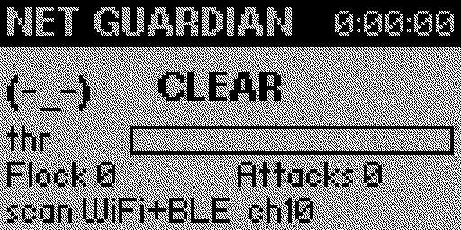
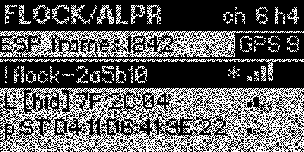
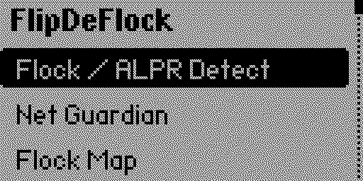
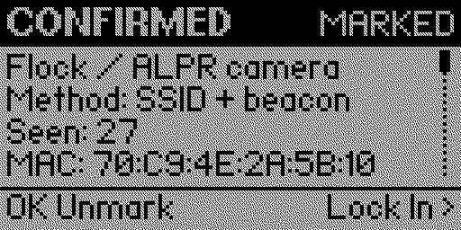
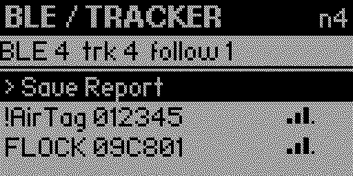
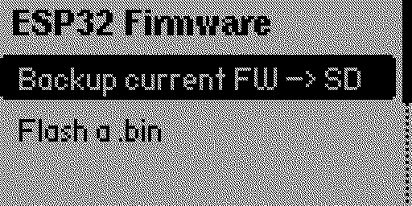

<p align="center">
  
</p>

<p align="center"><em>"Snoop onto them as they snoop onto us."</em></p>

FlipDeFlock is a Flipper Zero app that pairs the Flipper with an ESP32 board to
survey the radio around you for surveillance hardware: Flock Safety / ALPR
cameras, Bluetooth trackers that follow you, and active Wi-Fi attacks such as
deauth floods and evil-twin APs. The Flipper is the screen, GPS tagger, and
logger; the ESP32 does the Wi-Fi sniffing its BLE-only radio can't. It's for
security assessments, anti-surveillance awareness, and CTF/research.

**Passive recon only.** It listens; it never transmits — no deauth, injection, or
jamming. Detections are indicators, not proof: OUI-only matches are possible, not
confirmed, so verify by eye. Use it only where you are authorized to.

Builds against Flipper API 87.1, shared by current stock OFW and
[Momentum](https://github.com/Next-Flip/Momentum-Firmware).

**Free, and staying that way.** If FlipDeFlock is useful to you, crypto donations fund
development, test hardware, and the legal costs of mapping surveillance infrastructure.
[Donations never gate a feature](SUPPORTERS.md).

[](https://mempool.space/address/bc1qavy2wdhgpvqturn5he76mxclqr0a3vhg9sj4l8)
[](https://etherscan.io/address/0x481be1838e6B51B1a4013633877Bd967E2484694)
[](https://blockchair.com/litecoin/address/ltc1qpj3ppsgcdvx5yara9suljeq83t32macr8pe2yt)
[](https://blockchair.com/bitcoin-cash/address/qzl3a9emduev23nuh6wvk2nzwl5gguc9egmg83ae5a)

| Coin | Address |
|---|---|
| Bitcoin (BTC, native SegWit) | `bc1qavy2wdhgpvqturn5he76mxclqr0a3vhg9sj4l8` |
| Ethereum (ETH) | `0x481be1838e6B51B1a4013633877Bd967E2484694` |
| Litecoin (LTC, native SegWit) | `ltc1qpj3ppsgcdvx5yara9suljeq83t32macr8pe2yt` |
| Bitcoin Cash (BCH) | `bitcoincash:qzl3a9emduev23nuh6wvk2nzwl5gguc9egmg83ae5a` |

Bitcoin is also scannable from the Flipper itself: **FlipDeFlock → Support**.

## Install

Download `flipdeflock.fap` from the [latest release](../../releases/latest), copy
it to `apps/Tools/` on your Flipper's SD card, and launch **FlipDeFlock** from the
Tools menu. Every push also builds a fresh `.fap` as a CI artifact under the
**Actions** tab.

If a newer firmware bumps the API and the app refuses to load ("API mismatch"),
rebuild it with `ufbt` — see [Build from source](#build-from-source). Other common
problems — UART busy, no detections, GPS no-fix, flasher errors — are covered in
[Troubleshooting](docs/TROUBLESHOOTING.md).

## Hardware

The Flipper's onboard radio is BLE-only and can't do Wi-Fi monitor mode. Flock
cameras are found most reliably by the Wi-Fi probe requests they spray trying to
phone home, so the Wi-Fi work runs on an ESP32. Any ESP32 Flipper board works —
Wi-Fi Dev Board, ESP32 Marauder boards, ReksLab Tri-Board, bare WROOM/WROVER,
Xiao ESP32-S3.

Wire the ESP32 (and an optional GPS module) to the Flipper's GPIO:

| Device | Flipper port | Pins |
|--------|--------------|------|
| ESP32  | USART  | 13 (TX) / 14 (RX), 3V3, GND |
| GPS    | LPUART | 15 / 16 |

Both run at once. Ports and bauds are configurable in **Settings** for boards with
nonstandard pinouts. Turn **GPS** on in Settings to geotag detections. Settings
persist.

**GPS on the ESP board instead?** Some carrier boards wire their GPS module to the
ESP32 rather than to the Flipper header, so the Flipper cannot see it on any pin. Set
**GPS From** to `ESP32` and **ESP GPS Pin** to the ESP GPIO the module's TX is on; the
companion firmware then relays each NMEA sentence over the link it already has. Needs
companion firmware v0.52+. Default is `Flipper`, i.e. the pin table above.

### Board Mode

Set **Board Mode** in Settings to match your ESP32 firmware:

- **Marauder** — keep the board's existing firmware, no flashing. You get Flock /
  ALPR Detect, GPS, and Reports. The app scrapes MAC/SSID tokens
  from whatever Marauder prints and applies the Flock filter on the Flipper.
- **Companion** — the project firmware in `esp32_companion/`, a clean line
  protocol. Adds BLE / Tracker Scan, Net Guardian, Locator, passive deauth
  detection, and dual-band (Wi-Fi + BLE) Flock detection. Flash it from the
  app with **ESP32 Firmware** (no computer needed) or with Arduino IDE /
  arduino-cli (see [`esp32_companion/README.md`](esp32_companion/README.md)).

## What it does

Each item is a screen in the app. Screens marked *(companion)* need the companion
firmware; in Marauder mode they explain what's missing.

- **Flock / ALPR Detect** — the main camera hunt. Finds Flock Safety / ALPR cameras
  over Wi-Fi (and BLE, with the companion), geotags them, and lets you mark them
  for a report. Each row carries a confidence tag (see
  [Detection confidence](#detection-confidence)) and shows its source — probe,
  beacon, or BLE — in the detail view. A `!DEAUTH ch<n> <bssid>` banner appears
  while a deauth/disassoc flood is active and clears when it stops. Set **Alert on
  hit** in Settings (Vibrate / Beep / both) to be told about a camera you aren't
  watching the screen for — it fires once per device, and never for an OUI-only
  "Possible" lead.
- **Flock Map** — a live map around your GPS position: you're at center, cameras
  are plotted by bearing and distance, dot size is confidence, with a heading tick
  and a scale bar. Left/Right zoom, OK re-fits. Needs a GPS fix; ungeotagged
  cameras aren't plotted.
- **BLE / Tracker Scan** *(companion)* — detects AirTag / Tile / SmartTag / Google
  Find My trackers and Flock/Raven BLE. With GPS on, a tracker that stays with you
  across several waypoints is flagged `!FOLLOWING` (anti-stalking); open it for the
  track. Labels a **Flock Raven (audio sensor)** only when it sees the Raven's own
  Bluetooth services — it never guesses "camera" by elimination.
- **Net Guardian** *(companion)* — a leave-it-on-the-desk watch face. Keeps the ESP
  running and rotates it across Wi-Fi and BLE so the fused **CLEAR / WATCHFUL /
  ELEVATED** "am I being watched?" score stays live, with a pwnagotchi-style face
  and a haptic on the edge into ELEVATED. Counts Flock cameras, nearby Flipper
  Zeros, and active attacks — deauth/disassoc floods, evil-twin APs, and
  attack-tool signatures (BLE-spam, Pineapple/Marauder beacon-spam, probe floods).
  It reaches ELEVATED only when two independent radios agree. Press **OK** for a
  Suspicious list and send one to the Locator. An opt-in Anomaly flag (Settings,
  default off) adds unidentified-device flagging.
- **Locator** *(companion)* — hunt a marked device by live signal strength: a
  hot/cold meter that climbs as you get closer, peak-hold, and a warmer/colder
  trend. Mark a target from any Flock or BLE detection, or from the Guardian's
  Suspicious list. Works without GPS (a fix only adds a "strongest here" note).
  There's no compass arrow — direction-finding a transmitter needs a directional
  antenna, so you close in by walking.
- **ESP32 Firmware** — backs up the board's current firmware to SD, then flashes a
  `.bin` (companion, Marauder, or a backup) at `0x0`, straight from the Flipper.
  Put the ESP in bootloader/download mode first (hold **BOOT**, tap **RESET**). It
  talks to the bare ROM loader and MD5-verifies the write; flash speed is Safe
  (115200) or Fast (230400) in Settings. You can't brick it — the ROM bootloader
  always allows a re-flash. Built on Espressif's esp-serial-flasher. **Back up
  before you flash.**
- **Reports** — writes to `apps_data/flipdeflock/reports/`: Markdown,
  DeFlock-compatible GeoJSON, KML, plain CSV, and WiGLE CSV (Wi-Fi and BLE) for
  wardriving uploads. Reports stream row-by-row to SD, so a large scan won't run
  the Flipper out of memory. Pull them with qFlipper or a card reader.
- **Save hits** *(Settings, off by default)* — keeps your detections across app
  restarts in `apps_data/flipdeflock/hits.csv`, so closing the app doesn't throw
  a scan away. Restored hits come back in the list and on the map, showing the age
  of the stored sighting instead of a live signal reading. It is **off by default
  on purpose**: a hit log is a durable record of where you have been. Turning it
  back off deletes the file, and *Reports → Clear Saved Hits* erases it any time.
- **Share to DeFlock** — renders a QR per marked, geotagged camera that opens
  [DeFlock](https://deflock.org) at that location on your phone, so you submit
  through the official app's review flow. The Flipper and ESP never touch a
  network. No Flipper GPS? DeFlock lets you place the pin by hand at
  [deflock.org/report](https://deflock.org/report).

## Screenshots

<p align="center">
  
  <br><em>Net Guardian — the always-on watch face</em>
</p>

| | |
|:--:|:--:|
| <br>**Flock / ALPR Detect** | <br>**Main menu** |
| <br>**Why it was flagged** | <br>**BLE / Tracker results** |
| <br>**BLE / Tracker results** | <br>**ESP32 Firmware** |

<sub>Captured on a Flipper Zero running v0.49. The devices shown are fabricated
demo records — no real network, tracker or location appears in any screenshot.</sub>

## Detection confidence

Flock-associated OUIs are generic vendor prefixes (shared with Espressif and
others), so a prefix match alone is weak evidence. Confidence is scored
accordingly:

| Signal | Confidence |
|--------|------------|
| OUI prefix only | `Possible` |
| OUI + phone-home probe request | `Likely` |
| SSID is `Flock-` + 6 hex, or contains `test_flck` | `CONFIRMED` |
| Unverified user IE fingerprint | `Class?` (candidate device-class, never Confirmed) |

A benign name like `Flock-Guest` or `Flock Freight` does not Confirm — only the
exact provisioning-AP name does; those drop to `Likely`.

You can extend detection without a rebuild: drop `signatures.json` into
`apps_data/flipdeflock/` with extra `ouis`, `ssid_confirmed`, `ssid_likely`, and
`ie_fps` (8-hex probe fingerprints, capped at 32). It is load-only, offline, and
fail-safe — a missing or broken file falls back to the built-ins, and user entries
can only add detections, never override the precision rules (a user IE fingerprint
maxes out at `Class?`). Each detection's fingerprint shows as `IE-fp:` on its
detail screen, so you can read one off a confirmed camera and catch its
MAC-randomized twins. See the [signatures guide](docs/signatures.md).

## On-screen legend

RSSI is shown as signal bars (taller = stronger); the highlighted row shows the
exact dB. `-33dB` closer to 0 means physically closer.

**Net Guardian** — e.g. `(-_-) CLEAR · Flock 0  Atk 0  Flip 0 · WiFi+BLE ch6  OK=sus · 0:00:07`
- **face / word** — fused state: `(-_-)` CLEAR → `(o_o)` WATCHFUL → `(>_<)` ELEVATED
- **Flock / Atk / Flip** — this session's Flock detections · active attacks (flood-gated, so a lone benign disassoc doesn't count) · Flipper Zeros advertising nearby
- **bottom line** — sweep radio + channel + `OK=sus` (press OK for the Suspicious list). On an alert it names the cause: `Flipper Zero`, `BLE-spam`, `deauth flood`, `evil-twin AP`, `unknown device on you`
- **0:00:07** — guardian uptime. A Flipper alone raises WATCHFUL; ELEVATED still needs two independent radios

**Flock / ALPR Detect** — header `ESP ch6  frames 339  hits 0`
- **ESP** (or `...`) — companion connected / still waiting
- **ch / frames / hits** — channel · 802.11 frames captured · Flock detections, counted this session (reset each time you open the screen)
- **row tag** — `!` CONFIRMED · `F` probe-fingerprint · `L` Likely · `p` Possible · `.` OUI-only · `*` marked
- **`ST` after the tag** — a SoundThinking (ShotSpotter) acoustic sensor, not an ALPR camera. Untagged rows are cameras; the detail screen names the class in full
- **GPS badge** - filled `GPS 9` = locked with 9 satellites, hollow `GPS` = on and searching. A fault names what to fix and never says "GPS", because a filled badge starting with those three letters reads as a lock: `!PORT` = GPS and the ESP are on the same UART (put GPS on the other one, LPUART / pins 15-16), `!PIN` = the companion refused that ESP GPS Pin, `!FW` = the companion never answered, so reflash it
- Marauder mode shows `rx <n>  hits <n>` instead (serial heartbeat + detection count)

**BLE / Tracker Scan** — header `BLE 33  trk 9  follow 0`
- **BLE / trk / follow** — total BLE devices · known trackers · trackers flagged following you
- **row** — `<type> <name|MAC-tail> <rssi>dB`; type = `FLOCK` / `AirTag` / `Tile` / `Tag` / `FindMy` / `Flipper` / `BLE`. A `Flipper` is a recon device, not a tracker, so it isn't in `trk`
- **prefix** — `!` following · `*` tagged

**Locator**
- **mark first** — the report star on any Flock or BLE detection adds it to the Locator pool; or pick one from the Guardian's Suspicious list
- **meter / dB** — climbs as you get closer; `WARMER`/`colder` is the trend, the tick above the bar is peak-hold. `out of range` means the target went quiet — walk back to where it was loudest

## Build from source

With [ufbt](https://pypi.org/project/ufbt/) (standalone):

```sh
pip install ufbt
ufbt            # builds flipdeflock.fap in dist/
ufbt launch     # build + install + run on a connected Flipper
```

Inside a Momentum/OFW tree: drop this folder into `applications_user/` and run
`./fbt fap_flipdeflock`. For the ESP32 companion firmware, see
[`esp32_companion/README.md`](esp32_companion/README.md).

## Status

FlipDeFlock is actively developed, not finished. It's useful in the field, but
features are still landing, detection signatures change as surveillance hardware
changes, and not every path is hardware-tested on every board. Expect rough edges
and the occasional breaking change between versions. Treat detections as
indicators and verify by eye; if you rely on it for anything that matters, read
the code and confirm the behavior yourself.

## What's new

**v0.66** - **"Evil twin" now requires a security downgrade**, not just any auth-mode
difference. The old rule fired on WPA2/WPA3 transition mode, i.e. ordinary modern
networks. The Suspicious list also shows which BSSID is the open one instead of just
naming the SSID.

**v0.65** - **The asset pack now ships with releases** as `flipdeflock_asset_pack.zip`,
so the desktop animations can actually be installed without cloning the repo.

**v0.64** - **Asset pack gains a hoodie-kicks-the-camera-pole animation**, a tribute
to [@h00die](https://github.com/h00die). The on-screen version is also derived from
a single source now, so it can never disagree with the build it came from.

**v0.63** - **Help & Warnings is readable.** It shipped with prose hand-broken
mid-sentence; every line is now a short standalone phrase, opening with a summary
table of the GPS badge states.

**v0.62** - **Help & Warnings**, a new main-menu page explaining every mark the app
can show and how to fix the ones that matter. A GPS fault also now explains itself
on the scan screen, with the setting to change, dismissible with OK.

**v0.61** - **GPS fault badges no longer start with "GPS"**, which was being read as
the opposite of what it meant. They now name the fix: `!PORT`, `!PIN`, `!FW`. The
Wi-Fi glyph is also tightened so it reads as one mark.

**v0.60** - **The Flock header uses the Wi-Fi and Bluetooth glyphs** instead of the
letters `rx` and `b`, and the sub-line is now measured against the GPS badge so no
counter can ever grow into it.

**v0.59** - **Settings gains `Test alert`**: press Left/Right to fire the real
detection alert with your real settings. If it is silent the fault is the Flipper's
own Notifications settings or Alert on hit being off, not the detection side.

**v0.58** - **The version is on the main menu and About.** The Flock header also gains
`a<n>`, the count of alerts actually delivered, so "no beep" can be told apart from
the Flipper's own notification settings swallowing it; and `b-` now means no BLE scan
has completed yet, as distinct from `b0` meaning one ran and heard nothing.

**v0.57** - **Screen icons in the title bars.** A camera on Flock, a shield on Net
Guardian, a crosshair on the Locator, with `FLOCK/ALPR` shortened to `FDF` to hand
header width back to the counters. Also reclaims 156 bytes from the Settings pin
picker.

**v0.56** - **The Flock header shows live activity, not a total that only grows.**
`rx<n>/s` is the Wi-Fi frame rate, `b<n>` is BLE adverts this session (the screen
previously showed nothing about BLE at all), and `!r<n>` means the companion
restarted - which used to be hidden, appearing only as the count sliding back
toward zero.

**v0.55** - **ESP32-C5 correctness.** The **GPS pin picker no longer offers pins that
can cut the link** - it was a hardcoded classic-ESP32 list, and on a C5 four of those
pins do not exist, two are the flash bus and one is UART0 itself. The board now
reports its own usable pins. The companion's guard is likewise derived from the
chip's own headers rather than assuming a pinout. And **Band is now a Settings item
defaulting to 2.4 GHz**: a C5 previously swept 41 channels by default, revisiting any
given camera a third as often, which is why cameras were being missed.

**v0.54** — **Three bug fixes, one of them ours.** **Alerts never fired for a camera
you had already saved**, because restored entries came back with their alert latch
set and nothing cleared it, so turning on Save Hits silently disabled alerts for
every device you had driven past. **Net Guardian destroyed your Flock detections** on
entry and then persisted the empty table over `hits.csv`, so a reboot could not
recover them; it never needed to clear that table at all. And **`hits.csv` is no
longer deleted as a side effect of an empty table** — a v0.53 regression that turned
the Net Guardian bug into permanent data loss. Also, the GPS badge now distinguishes
`GPS?` (companion never answered — reflash) from `GPS!` (it refused the pin — change
the pin), instead of sitting on "searching" forever.

**v0.53** — **Two UI requests, both verified on hardware.** You can now **remove a
detection** from the detail screen (Left, then confirm) — persistence had made a false
positive permanent, and the delete writes through to the card immediately. Every hit
also carries a **Wi-Fi or Bluetooth glyph** on the list and detail screens, since which
radio saw a device was otherwise unknowable from the row. **Fixed:** deleting the last
stored detection now removes `hits.csv` instead of restoring everything on next launch,
and long SSIDs no longer run off the right edge of a list row.

**v0.52** — **GPS off the companion board**, plus two bugs that made working features
look broken. Settings gains a **GPS source** choice (`Flipper` / `Companion`) and the
ESP pin the module's TX lands on — on boards that wire GPS to the ESP32 there was no
way to use it before, since the Flipper's UART pins simply are not connected to it
(needs companion firmware v0.52+). **Fixed:** detection alerts never fired while the
**Locator** was open, the screen you are most likely to be watching during a hunt; the
companion dropped every GPS sentence that arrived during a BLE scan, so wardriving lost
fixes; flashing the companion failed before writing a byte on slower flash chips; and a
successful flash ended with a `COMMAND_FAILED` line that contradicted the `Verified OK.`
above it.

**v0.51** — **A quarter of the memory footprint, gone.** Users on heavier firmware were
being refused at launch with *"Not enough RAM to run the app"*
([#5](https://github.com/ReconGrunt/FlipDeFlock/issues/5)); the app image is now
**86,810 → 65,054 bytes (−25.1%)**. **Breaking: the NFC / RFID Audit and WiFi Audit
screens are removed** — this app detects surveillance hardware, and those were 13.4 KB
of an image that was failing to load. **Net Guardian is unaffected**: it still runs the
Wi-Fi sweep and still flags evil-twin APs, because its score only reaches ELEVATED when
two independent radios agree. The QR encoder now loads on demand from a plugin bundled
inside the `.fap` (still a single-file install). Cheaper trig and tighter detection
structs make up the rest. **Fixed:** *Share to DeFlock* had reported "No marked cameras"
no matter what was marked, since v0.48.

**v0.50** — Finishes a v0.49 fix that only landed on one of the three scanner
screens. **No detection logic changed.** The WiFi Audit and BLE / Tracker lists were
still swapping the signal bars for raw `-70dB` text on the selected row, above a
comment describing the very behaviour v0.49 had removed — so the mixed-notation
problem [#5](https://github.com/ReconGrunt/FlipDeFlock/issues/5) reported outlived
the release meant to fix it, and v0.49's claim that *every* list was corrected was
wrong. Both lists now draw bars on every row; the exact dBm is still on each detail
screen. README screenshots are also refreshed for the v0.49 UI.

**v0.49** — A UI pass over the Flock/ALPR screens, entirely from a field report by
[@h00die](https://github.com/h00die) on an ESP32-C5 card. **No detection logic
changed** — this is about reading and acting on a hit. The detail screen now answers
*why* something was flagged with a `Method:` line (`OUI + beacon`, `SSID + beacon`,
`BLE mfg ID`), re-derived locally rather than taken on the companion's word, so an
OUI-prefix lead and an SSID-pattern match are no longer both just "Possible". That
screen is a proper view now: one labelled field per line, scrollable, with real
signal bars — the old run-on line wrapped mid-word. **Lock In** (Right on any
detection) jumps straight into the Locator's homing HUD for that device instead of
making you mark it and hunt for it in a list. **Alert level** in Settings picks the
lowest confidence that may buzz (`Any` / `Likely` / `Confirm`); the default is
unchanged, and `Any` is opt-in because it will raise false positives. Also: the
header stopped printing the channel and hit count twice, GPS is a filled/hollow
badge instead of `G:3`, and signal strength is drawn as bars everywhere — the
selected row used to fall back to raw dB text because the bars were being forced to
black and rendered invisible.

**v0.48** — A false positive on the BLE side, and a bug that quietly switched off four
features. BLE devices were shown as **CONFIRMED** Flock on nothing more than a
shared silicon-vendor OUI (Espressif, Liteon), so ordinary ESP32 hardware was
announced as a surveillance camera — the same over-claim as v0.47, on a path that
fix never covered. **Expect fewer things flagged**: without a Flock-specific tell
they now read Possible. Separately, a BLE device's freshness timestamp only updated
when GPS had a fix, and GPS is off by default, so the "Flipper near" signal, the
Guardian counter, the anomaly window and the "FOLLOWING you" timer all silently
expired ~90 s into every session. Also: companion hardening (a truncated SSID
element was reported as a hidden network — reflash to get it), dropped serial bytes
no longer corrupt a record silently, `flock_score()` deleted for having no callers,
first-ever tests for the BLE decoder and the whole Marauder backend (639 → 763
checks), a CI gate so the two OUI tables cannot drift apart, and ~5.9 KB of RAM
reclaimed. On the companion side: it **builds on Arduino core 3.x again** (it had
stopped compiling entirely for anyone with a current install — thanks
[@h00die](https://github.com/h00die)), CI now guards that on every push instead of
only on tags, and there is an **experimental ESP32-C5 dual-band build** that scans
5 GHz as well as 2.4. Nobody here owns a C5, so that one is compile-verified only.

**v0.47** — False-positive fix; **upgrade if you're on v0.46**. Networks whose name
merely contains `flock-` (`Flock-Guest`, `Flock-Safety-Corp`, `Flock-12345`) were
shown as CONFIRMED — the anchored SSID rule existed and was tested, but nothing on
the default code path called it. Now fixed on both sides: the companion's matcher is
anchored, and the app re-derives any claimed CONFIRMED itself, so an already-flashed
companion is corrected without a reflash.

**v0.46** — Detects **SoundThinking / ShotSpotter acoustic sensors** as a separate
device class (tagged `ST`, never folded into the camera list), and reports
**hidden-SSID beaconing** — the behaviour Flock moved to when broadcast-SSID
scanning stopped working. Hidden is shown as an observation, not scored: consumer
routers hide SSIDs too. Also six more candidate OUIs in the unverified seed file,
channel hop extended to 1-13, and a bench emitter that exercises every confidence
rung so changes stop being verified by compiler alone.

**v0.44** — Signature quality. The OUI list now tracks a curated upstream table with
per-prefix status instead of a flat one that couldn't record doubt: `f8:a2:d6` is
dropped (upstream retracted it after a false hit on a Sony media player), and two
uncorroborated candidates ship in a new `docs/signatures.seed.json` rather than the
trusted built-ins. A 1,200-prefix bulk scrape was reviewed and rejected.

**v0.43** — Precision, correctness, and a test safety net; no new screens. Only the
real `Flock-` + 6-hex provisioning name Confirms now, and an OUI + broadcast-probe
match caps at Likely. Fixes across NFC (verdict binds to the card actually
presented), GPS (no stale fix, checksum-verified NMEA), and report escaping (a
hostile SSID/BLE name can't break a CSV column or inject a KML element). Adds a
291-check host unit-test suite wired into CI and a companion wire-protocol version
handshake.

**v0.42** — Catch MAC-randomizing cameras via probe IE fingerprints, updatable from
`signatures.json` (`ie_fps`) without a rebuild; each detection's `IE-fp:` is shown
so you can harvest it from a confirmed unit.

**v0.41** — Locator (find a marked device by signal) and a Suspicious list on the
Net Guardian.

**v0.34–v0.39** — Net Guardian: the always-on fused watch face, then Flipper /
attack-tool / opt-in anomaly detection on top of deauth floods and evil-twin APs.

**v0.25** — Positive Raven (audio sensor) labeling, and the updatable
`signatures.json` database.

Full history in [changelog.md](changelog.md).

## Layout

```
application.fam          manifest
recon_app.c / _i.h       lifecycle, shared state, settings
scenes/                  start, flock, guardian, locator, map, ble, firmware,
                         reports, deflock_handoff, settings, about
views/                   flock list, on-device map, DeFlock QR, guardian face,
                         locator HUD, ble list
helpers/
  flock_db / detect_rules / sig_db   Flock OUIs, SSID/IE signatures, confidence scoring
  esp_link / esp_parser              ESP32 UART link (companion + generic backends)
  esp_flasher                        in-app ESP32 backup/flash (esp-serial-flasher port)
  gps_link / gps_parser              NMEA GPS reader (2nd UART)
  recon_report / report_escape       Markdown + GeoJSON + KML + CSV/WiGLE writers
  watchscore / scan_session          fused surveillance score, scan lifecycle
lib/esp-serial-flasher/  vendored Espressif flasher (Apache-2.0)
lib/qrcodegen/           vendored Nayuki QR Code generator (MIT)
esp32_companion/         universal ESP32 firmware + flashing guide
```

Prebuilt binaries are published on [Releases](../../releases) and as per-push CI
artifacts, not committed to the repo.

## Credits

The detection method and Flock OUI prefixes build on
[colonelpanichacks/flock-you](https://github.com/colonelpanichacks/flock-you),
[0xXyc/flock-you-wifi-recon](https://github.com/0xXyc/flock-you-wifi-recon), and
the [DeFlock](https://deflock.org) community. The GPS NMEA approach is based on the
Momentum Sub-GHz GPS helper.

Candidate OUI prefixes, the SoundThinking prefix, and the hidden-SSID observation
come from [JakeSwiz/WatchFlock](https://github.com/JakeSwiz/WatchFlock) by Jake /
Swiz Security, itself built on
[justcallmekoko/ESP32Marauder](https://github.com/justcallmekoko/ESP32Marauder).
No code was taken — the signatures and the finding are, with thanks. Which prefixes
were and weren't imported, and why, is recorded in
[docs/signatures.md](docs/signatures.md).

## License

**GPL-3.0-or-later** — see [LICENSE](LICENSE). Copyright (c) 2026 ReconGrunt and
FlipDeFlock contributors.

If you distribute a modified version, publish your source under the same terms and
keep the notices intact. Bundled third-party components keep their own compatible
licenses: esp-serial-flasher (Apache-2.0), Nayuki qrcodegen (MIT), jsmn (MIT), and
the ESP MD5 routine (BSD) — see the headers under `lib/`.

**Name & trademark.** The code is free to reuse under the GPL, but the
**"FlipDeFlock"** name and logo are the project's identity, not part of the
licensed code. Don't publish a fork, repackage, or store listing under the
FlipDeFlock name or logo in a way that implies it's official. Rename your
derivative — a "based on FlipDeFlock" credit is welcome. Forking on GitHub keeps
the link and credit intact.

## Contributing

This is a community counter-surveillance effort; it improves with more boards and more
field data. The most useful contributions are **field reports and signatures** (new
Flock/ALPR OUIs, SSID/BLE patterns, probe IE fingerprints — and detections that
misfired), **board support** reports, and code.

Ground rules: passive recon only, correctness over features, API 87.1, and keep it lean.
Full details, the DCO sign-off requirement, and contribution licensing are in
[CONTRIBUTING.md](CONTRIBUTING.md).

Questions, board reports and ideas are welcome in
[Discussions](https://github.com/ReconGrunt/FlipDeFlock/discussions). Bugs and feature
requests belong in [Issues](https://github.com/ReconGrunt/FlipDeFlock/issues/new) —
please open a **new** one even if a closed issue looks related, since closed threads
are not watched.

Found a security issue? Please follow [SECURITY.md](SECURITY.md) rather than opening a
public issue.

## Support

FlipDeFlock is free and stays that way. To help cover development (and the legal
costs of mapping surveillance hardware), crypto (BTC, ETH, LTC, BCH) is accepted —
addresses are near the top of this README and in [SUPPORTERS.md](SUPPORTERS.md).
Donations never gate a feature.

GitHub Sponsors is temporarily unavailable.

What supporters get — recognition and early access to release candidates, never
functionality — is spelled out in [SUPPORTERS.md](SUPPORTERS.md).
