<!-- banner -->
<p align="center">
  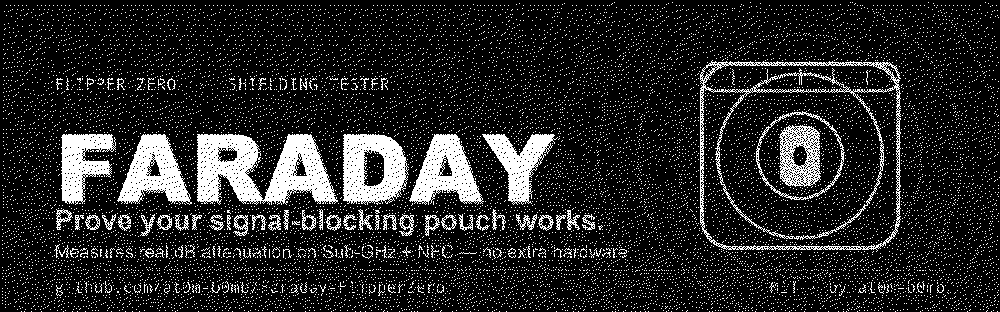
</p>

<h1 align="center">Faraday 🛡️</h1>
<p align="center"><i>Prove your signal-blocking pouch actually works.</i></p>

<p align="center">
  
  
  
  
  
</p>

<p align="center">
  Everyone buys a Faraday pouch for their car key or their contactless cards. Almost nobody
  <b>checks</b> that it works. <b>Faraday</b> turns your Flipper Zero into the instrument that checks:
  it measures your key fob in the open, measures it again sealed in the pouch, and tells you
  <b>exactly how many decibels the pouch actually took off</b> — with a grade from <b>A+</b> to <b>F</b>.
</p>

<p align="center"><sub>A pouch is a claim. This is the measurement.</sub></p>

---

## 📟 On the Flipper

<p align="center">
  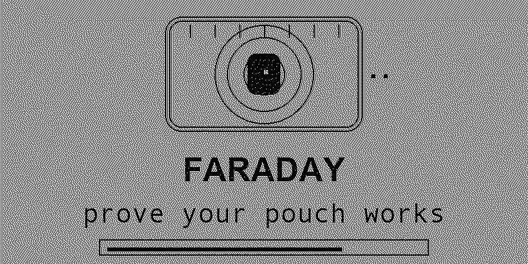
</p>
<p align="center">
  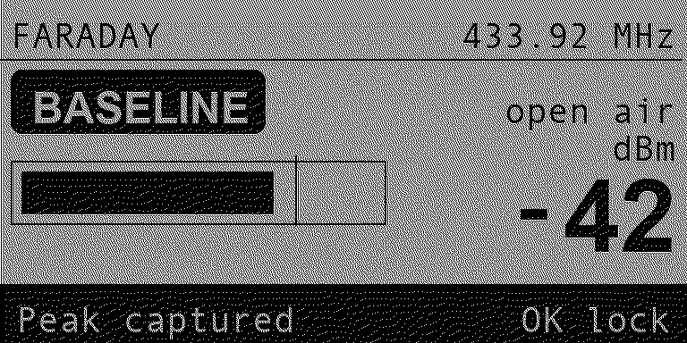
  &nbsp;
  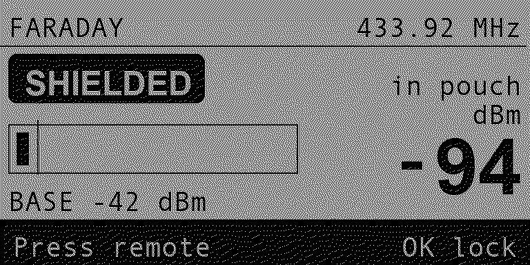
  &nbsp;
  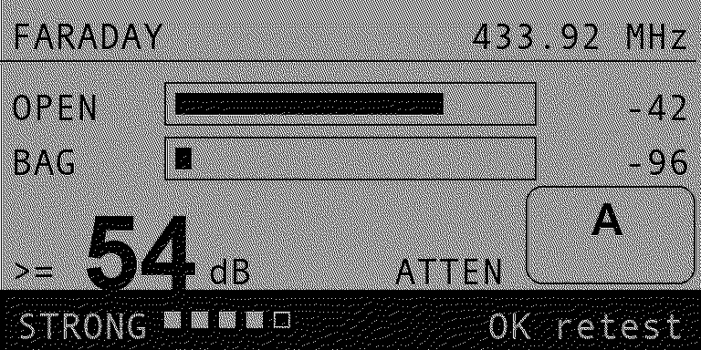
</p>
<p align="center">
  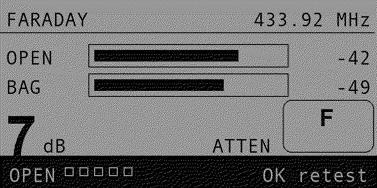
  &nbsp;
  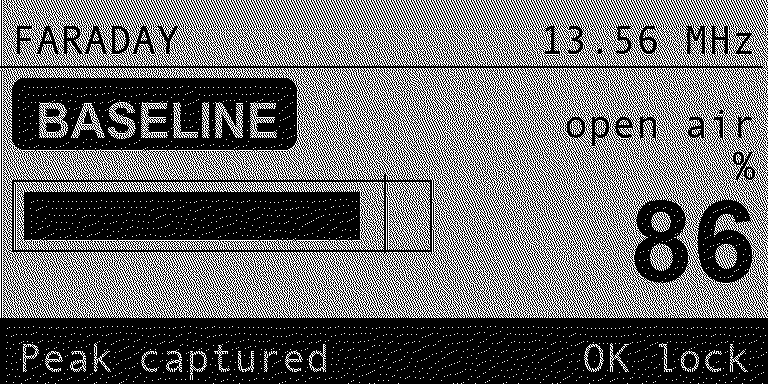
  &nbsp;
  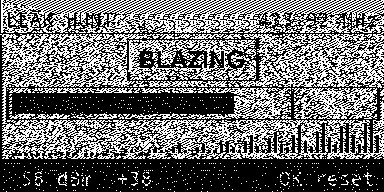
</p>
<p align="center">
  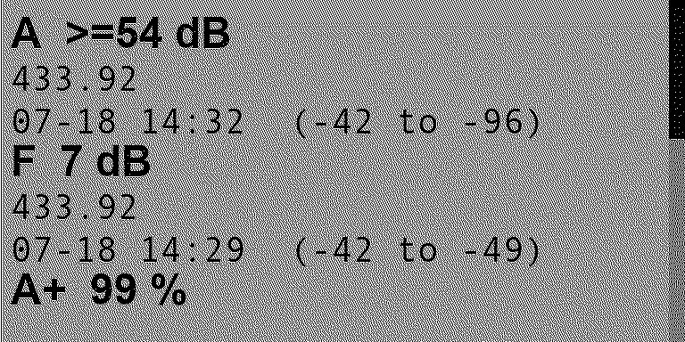
  &nbsp;
  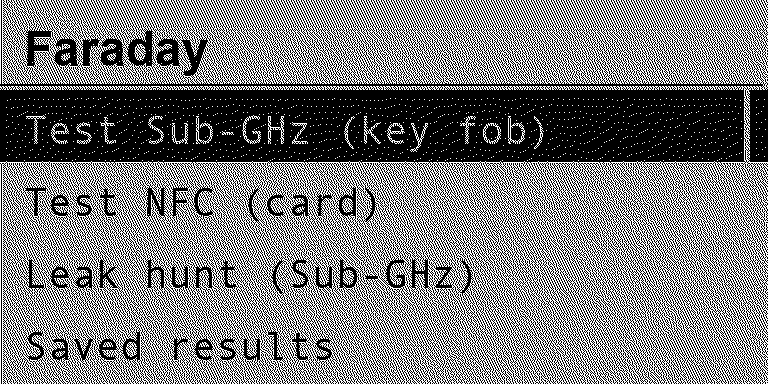
  &nbsp;
  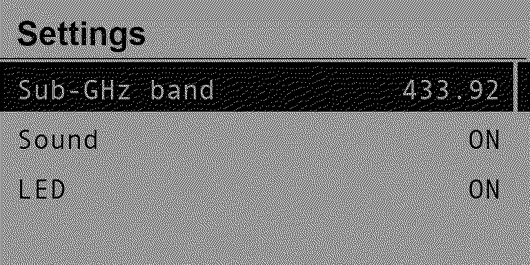
</p>
<p align="center">
  <sub><b>1. Baseline</b> — open air &nbsp;·&nbsp; <b>2. Shielded</b> — in the pouch &nbsp;·&nbsp;
  <b>3. Verdict</b> — the dB drop, graded &nbsp;·&nbsp; a pouch that <b>fails</b> &nbsp;·&nbsp;
  <b>NFC</b> mode &nbsp;·&nbsp; <b>Leak Hunt</b> &nbsp;·&nbsp; <b>Saved results</b> &nbsp;·&nbsp;
  <b>Menu</b> &nbsp;·&nbsp; <b>Settings</b></sub>
</p>

---

## ✨ Features

- 📉 **A real number, not a vibe.** Sub-GHz attenuation is measured in **actual decibels** from the
  internal CC1101's RSSI. `-42 dBm` in the open, `-96 dBm` in the pouch → **54 dB of shielding**.
- 🅰️ **A grade you can act on.** `A+ SEALED` · `A STRONG` · `B GOOD` · `C FAIR` · `D WEAK` · `F OPEN`,
  with a one-line verdict so you know whether to trust the pouch or bin it.
- 🎛️ **Two radios, one flow.** **Sub-GHz** for car keys, garage and gate remotes (315 / 433.92 /
  868.35 / 915 MHz). **NFC** for the 13.56 MHz reader field that skims contactless cards.
- 🎯 **Two taps, start to finish.** Capture baseline → seal the pouch → capture again. The peak-hold
  does the work; you just press **OK** twice.
- 🔦 **Leak Hunt finds *where* it leaks.** A grade tells you a pouch is bad. Leak Hunt tells you the
  seam. Seal your fob, hold its button, sweep the Flipper along the edges — the meter, the
  `COLD → COOL → WARM → HOT → BLAZING` word and the geiger clicks all peak over the escaping spot.
- 💾 **Saved results.** Every finished test is appended to a CSV on the SD card with a timestamp, so
  you can measure three pouches in a shop and compare them properly instead of trusting memory.
- ⚙️ **Settings stick.** Band, sound and LED survive a reboot.
- 🧾 **It admits what it can't see.** If the shielded signal falls **below the noise floor**, Faraday
  reports **`>= 54 dB`** rather than pretending to a precision it doesn't have.
- 🚫 **It refuses bad data.** Press OK before your fob has actually transmitted and it buzzes and
  declines — an unpressed fob would otherwise "prove" any pouch perfect.
- 🕶️ **Listen-only.** Faraday **never transmits** on either radio. It only measures what reaches it.
- 🔌 **Zero extra hardware.** Onboard CC1101 + onboard ST25R3916. Nothing to flash, nothing to wire.
- ✨ **Built to feel good.** An animated intro, a verdict that grows in with a filled *pass* badge (or
  an outlined *warning* one), a marker that sweeps while listening, and a live sparkline of the signal.

---

## 🧠 How it works

Shielding is a **comparison**, not an absolute. So every test is the same three steps on both radios:

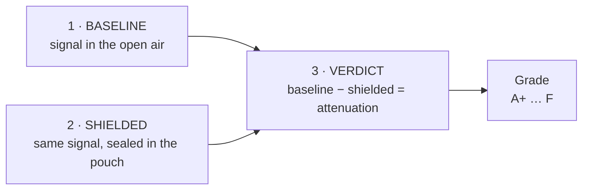

### Sub-GHz — the flagship measurement

Your fob's transmitter is the signal source, so the reading is a **genuine RF power measurement**.

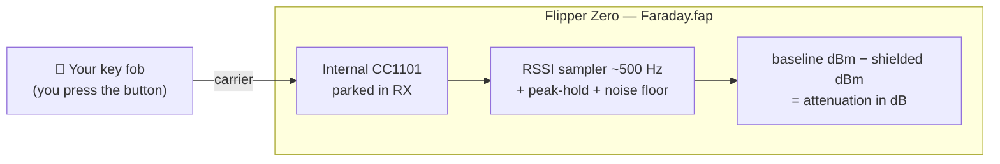

Faraday tracks the **noise floor** alongside the peak. That floor is what makes the two honest
behaviours above possible: it's how the app knows your fob actually transmitted, and how it knows
when a shielded reading has sunk out of sight and must be reported as a **lower bound**.

### NFC — the field the skimmer would use

A card is passive, so there's nothing to transmit — the thing worth measuring is **how much of a
reader's interrogation field survives the pouch**. Hold the Flipper in a reader's field (a phone
doing NFC works fine) to set the baseline, then seal the Flipper in the pouch and measure again.
The ST25R3916's external-field detector reports carrier duty-cycle, so the score is the
**percentage of the field the pouch kept out**.

> Because duty-cycle is a presence measure rather than a power measure, NFC is graded in **% blocked**
> and not in dB. Faraday does not dress one up as the other.

---

## 🚀 Install

No devboard, no firmware to flash — it's a single `.fap`.

**Option A — prebuilt `.fap` (easiest)**

1. Grab `faraday.fap` from the [**Releases**](https://github.com/at0m-b0mb/Faraday-FlipperZero/releases) page.
2. Open **qFlipper**, drag the file onto `SD Card / apps / Tools /`.
3. On the Flipper: **Apps → Tools → Faraday**.

**Option B — build it yourself with [`ufbt`](https://github.com/flipperdevices/flipperzero-ufbt)**

```bash
# one-time
python3 -m pip install --upgrade ufbt

# from the repo root, with your Flipper plugged in over USB:
ufbt            # build faraday.fap into ./dist
ufbt launch     # build, upload to the Flipper and open it
```

```bash
make -C test    # run the grading-engine unit tests on your machine
```

> Icons in `icons/`, screenshots and the banner in `images/` are generated — regenerate with
> `python3 tools_gen_icons.py`, `python3 tools_gen_mockups.py` and `python3 tools_gen_banner.py` (needs `pillow`).

---

## 🎮 Using it

### Testing a key fob (Sub-GHz)

1. **Settings → Sub-GHz band** — pick the band your fob uses (**433.92** covers most of Europe/Asia,
   **315** most of North America). If you don't know, try both; the wrong band simply never registers.
2. **Test Sub-GHz (key fob)**. Hold the fob a hand's width from the Flipper and **press its button a
   few times**. The bar climbs and the strip flips to **`Peak captured`**.
3. Press **OK** to lock the **baseline**.
4. **Seal the fob in the pouch.** Put it back in **exactly the same spot** — same distance, same angle.
5. Press the fob again through the pouch, then press **OK** to lock the **shielded** reading.
6. Read the verdict: the dB drop and the grade. Press **OK** to run it again.

### Testing a card pouch (NFC)

1. Start a reader field — hold your phone with NFC on, or use a contactless terminal.
2. **Test NFC (card)**, hold the Flipper in that field until the bar rises, press **OK**.
3. Seal **the Flipper** in the pouch, hold it back in the same field, press **OK**.
4. The score is how much of the reader's field the pouch kept out.

> 💡 **The distance is the experiment.** Both readings must be taken from the same spot. If you move
> the fob 20 cm further away for the second capture, you'll measure the inverse-square law, not
> the pouch. When in doubt, tape the fob and the Flipper down.

### Finding the leak (Leak Hunt)

Once you know a pouch leaks, this tells you where — usually the seam, the fold, or a worn corner.

1. Seal the fob in the pouch and **hold its button down** so it keeps transmitting.
2. **Leak hunt (Sub-GHz)**, then sweep the Flipper slowly along the pouch: every edge, the zip or
   fold, each corner.
3. Follow the word and the clicks: `COLD → COOL → WARM → HOT → BLAZING`. The rolling trace at the
   bottom shows the shape of the sweep you just made, so a spike tells you to go back a centimetre.
4. Press **OK** to reset the peak and re-sweep a spot cleanly.

### Comparing pouches (Saved results)

Every finished test is written to `/ext/apps_data/faraday/results.csv` with a timestamp.
**Saved results** shows the most recent 20 on-device, newest first. Pull the CSV off with qFlipper
to compare pouches in a spreadsheet — or delete the file there to start a fresh log.

---

## 🔬 Honest limitations

- **This is a comparison, not a lab certification.** Faraday reports the difference between two
  readings **you** took. It is only as good as your consistency between them. It is not a calibrated
  anechoic-chamber shielding-effectiveness figure and shouldn't be quoted as one.
- **Sub-GHz needs your fob to actually transmit.** Faraday is listen-only; it does not interrogate
  anything. No button press, no measurement — which is why it refuses to lock a silent baseline.
- **NFC needs an external reader field** to measure against, and is scored in **% of field blocked**,
  not dB.
- **`>=` means the signal vanished into the noise.** The pouch is *at least* that good. The true
  figure may be higher — the Flipper simply can't see past its own noise floor.
- **13.56 MHz only.** The NFC test cannot see **125 kHz (LF)** prox cards; the Flipper's LF path has
  no field-detect equivalent.
- **One radio at a time.** The NFC test takes over the NFC chip — close other NFC apps first, or it
  will report *NFC busy*.
- **A pouch can pass here and still fail elsewhere.** A bag that blocks 433 MHz beautifully may leak
  at 868 MHz or at 13.56 MHz. Test the band you actually care about.
- **Leak Hunt is comparative, and needs a fob that keeps transmitting.** It shows you where the
  signal is *strongest*, relative to the noise floor — not an absolute leak rating. Most fobs stop
  transmitting after a few seconds, so tap the button repeatedly as you sweep. And RF is reflective:
  a "hot spot" can occasionally be a reflection off something nearby rather than the seam itself,
  so confirm a find by sweeping it twice from different angles.

---

## ⚖️ Legal & ethical

Faraday is a **defensive, listen-only measurement tool**. It never transmits, never replays, never
clones and never reads a card. Use it on **your own** keys, cards and pouches, or hardware you are
**explicitly authorised** to assess. You are responsible for how you use it. Know your local laws.

---

## 🗺️ Roadmap

- [x] Persist band / sound / LED across reboots — *v1.1*
- [x] Save test results to the SD card (CSV) to compare pouches over time — *v1.1*
- [x] A "leak hunt" mode that finds *where* on the seam a pouch leaks — *v1.1*
- [ ] Optional averaged multi-press capture for a tighter baseline
- [ ] On-device comparison of two logged results side by side
- [ ] Investigate an LF (125 kHz) coil-based sense as a separate mode

> **Dropped:** *"sweep every Sub-GHz band in one run for a per-band profile."* It sounds good and
> isn't physically meaningful — your fob transmits on **one** band, so the other three would just
> measure ambient noise and report a flattering, meaningless attenuation. To profile a pouch across
> bands you need a different transmitter per band, which is a separate test each time.

---

## 🗂️ Project layout

```
Faraday-FlipperZero/
├── application.fam              # Flipper app manifest (category: Tools)
├── faraday.c / faraday_i.h      # app entry, wiring, feedback, test state
├── helpers/
│   ├── fdy_subghz.{c,h}         # CC1101 RSSI probe (dBm, peak-hold, noise floor)
│   ├── fdy_nfc.{c,h}            # ST25R3916 field-detect probe (carrier duty-cycle)
│   ├── fdy_store.{c,h}          # settings persistence + CSV result log
│   └── fdy_grade.{c,h}          # pure grading engine — no Flipper deps, host-tested
├── views/
│   ├── meter_view.{c,h}         # capture meter + verdict card (both radios)
│   └── hunt_view.{c,h}          # leak-hunt sweep meter + rolling trace
├── scenes/                      # start · subghz · nfc · hunt · results · settings · about
├── test/                        # host unit tests for the grading engine
├── icons/                       # 1-bit Flipper icons (generated)
├── images/                      # banner + screen mockups (generated)
└── tools_gen_*.py               # regenerate icons / mockups / banner
```

---

## 🙏 Credits

- Built by **[at0m-b0mb](https://github.com/at0m-b0mb)**.
- Part of a Flipper security-tool family: **[Specter](https://github.com/at0m-b0mb/Specter-FlipperZero)** (NFC reader/skimmer sweep), **[Cerberus](https://github.com/at0m-b0mb/flipper-cerberus)** (Sub-GHz RF watchdog), **[RollCall](https://github.com/at0m-b0mb/RollCall-FlipperZero)** (rolling-code health check) and **[Argus](https://github.com/at0m-b0mb/Argus-FlipperZero)** (Wi-Fi deauth detector).
- Powered by the [Flipper Zero firmware](https://github.com/flipperdevices/flipperzero-firmware) Sub-GHz device API and NFC HAL, plus [ufbt](https://github.com/flipperdevices/flipperzero-ufbt).

## 📄 License

[MIT](LICENSE) © 2026 at0m-b0mb
