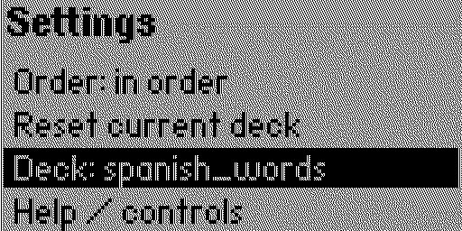

# FlipFlash

FlipFlash is a Flipper Zero flashcard app that reads flashcards from a text file and support removing cards from the deck. Useful for e.g., leaning language, I guess? 

## Screenshots




## Deck format

The flashcard deck files are stored on the Flipper at `/ext/apps_data/FlipFlash/flashcardFile.txt`. It supports adding self-defined text (`.txt`) files, just upload directly to the folder. 

Each card uses one line in the form:

`front|back`

Blank lines and lines starting with `#` are ignored.

Example:

```
hola|hello
adios|goodbye
```

### Sample decks

On first launch, FlipFlash creates two small Spanish test decks (spanish_words.txt and spanish_verbs.txt) automatically if the deck file does not exist. 

## State storage

The app stores the current mode and removed-card list for each of the flashcard file in:

`/ext/apps_data/FlipFlash/flashcardFile.state`

## Controls

- `OK`: Flip front/back, then advance to the next card when the back is shown. 
- `RIGHT`: Go to the next card. 
- `UP`: Open settings. 
- `DOWN`: Remove the current card. 
- `BACK`: Cancel, return to previous screen or exit the app. 

## Settings

- `Order`: Toggles the order folloing which flashcards are shown (`in order` or `random`). 
- `Reset current deck`: Add all removed cards back to the deck, set the order to `in order`, and start from the beginning of the deck. 
- `Deck`: Choose the deck. Note that the first time a flashcard deck is loaded, the screen automatically return to showing the cards, otherwise, it stays at the menu page. 
- `Help`: Show help page. 
- `Back to deck`: Return back to the flashcard page. 

## Installation

### 1. Install with uv

#### a). Install uv
If you do not have `uv` installed yet, install it following the link: [Installing uv](https://docs.astral.sh/uv/getting-started/installation/). 


#### b). Install Project Dependencies
Run the following command in the project root. `uv` will automatically create a virtual environment (`.venv`) and install all required packages listed in `pyproject.toml`: 
```bash
uv sync
```

#### c). Build
```
uv run ufbt
```
The `.fap` file is stored at `dist/`, simply upload it to `app/tools` folder. 

Or run
```
uv run ufbt launch
```
Whe a flipper zero is connected, it will automatically install. 

### 2. Install directly ufbt

#### a). Install ufbt
```bash
python3 -m pip install --upgrade ufbt
```

#### b). Build
```bash
ufbt
```
The `.fap` file is stored at `dist/`, simply upload it to `app/tools` folder. 

Or run
```
ufbt launch
```
Whe a flipper zero is connected, it will automatically install. 