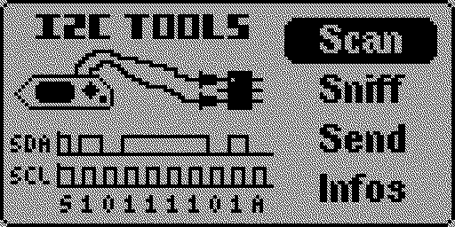
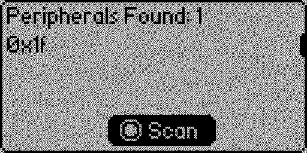
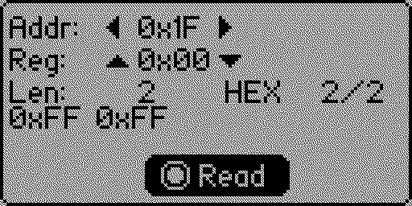
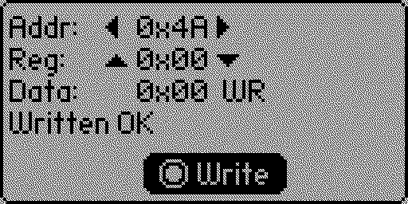
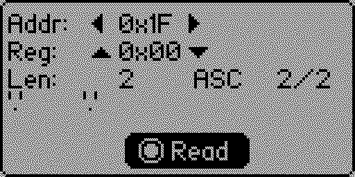
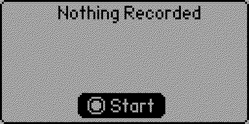
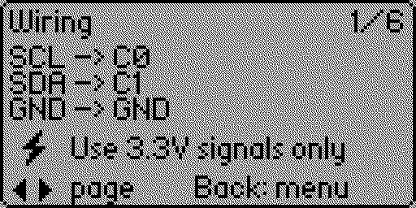
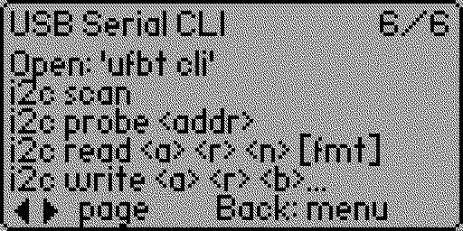

# User Guide — I2C Tools CLI

This guide covers **every feature** of *I2C Tools CLI* — the on-device GUI and the USB serial CLI — with screenshots and worked examples.

> Compact reference: the app embeds a 6-page **Infos** view (Main menu → `Infos`). This document expands those pages with examples and edge cases.

---

## Table of contents

1. [Hardware setup](#hardware-setup)
2. [Launching the app](#launching-the-app)
3. [GUI — Main menu](#gui--main-menu)
4. [GUI — Scanner](#gui--scanner)
5. [GUI — Sender (READ mode)](#gui--sender-read-mode)
6. [GUI — Sender (WRITE mode)](#gui--sender-write-mode)
7. [GUI — HEX / ASCII display](#gui--hex--ascii-display)
8. [GUI — Sniffer](#gui--sniffer)
9. [GUI — Infos pages](#gui--infos-pages)
10. [Serial CLI](#serial-cli)
11. [Worked examples](#worked-examples)
12. [Troubleshooting](#troubleshooting)
13. [Limits & known constraints](#limits--known-constraints)

---

## Hardware setup

I²C tools drive the Flipper's **external** I²C bus (`furi_hal_i2c_handle_external`). Internal pull-ups are enabled automatically — no external resistors are needed for short jumper wires.

| Flipper pin | Function |
|---|---|
| C0 | SCL |
| C1 | SDA |
| GND | GND |
| (3V3 on pin 9 if your peripheral needs power) | 3.3 V |

> **3V3 only.** The Flipper GPIO are **not 5 V tolerant**. Hooking a 5 V I²C bus directly to C0/C1 can damage the MCU. Use a level shifter (e.g. PCA9306, TXS0108E) for 5 V peripherals.

Internal pull-ups are sufficient up to ~100 kHz. For long wires or many devices, add external 4.7 kΩ pull-ups to 3V3.

---

## Launching the app

After installing via the Catalog (or `ufbt launch`), navigate on the Flipper to:

```
Main menu → Apps → GPIO → I2C Tools CLI
```

The app icon shows **"I2C"** above a **">_"** prompt to remind you both the GUI **and** the serial CLI are available simultaneously.

When the app starts, the `i2c` command is **registered** in the CLI registry. It is **unregistered** when you exit back to the main Flipper menu.



---

## GUI — Main menu

Four entries, navigated with **Up / Down**, entered with **OK**, left with **Back**:

| Entry | Purpose |
|---|---|
| `Scan` | Scan addresses 0x01..0x7F on the external bus. |
| `Sniff` | Passive sniffer: decodes I²C frames flowing on the bus. |
| `Send` | Send single-register reads / writes interactively. |
| `Infos` | In-app help (wiring, key map, CLI usage). |

Short **Back** from the main menu exits the app and **unregisters** the CLI command.

---

## GUI — Scanner



| Key | Action |
|---|---|
| `OK` | Run a scan (probes addr 0x01..0x7F). |
| `Up` / `Down` | Move 1 row in the result list. |
| `Long Up` / `Long Down` | Jump 5 rows. |
| `Back` | Return to the main menu. |

Each address that ACKs (driver releases SDA on the 9th clock) is printed in the grid. The Sender view consumes the same address list — after a scan, Sender's Left/Right cycles through what was just discovered.

---

## GUI — Sender (READ mode)

The Sender view is the most feature-rich. By default it starts in **READ** mode.



Three editable fields:

| Field | What it is | Key |
|---|---|---|
| `Addr` | 7-bit device address (drawn from the last scan) | `Left` / `Right` |
| `Reg` | Register byte sent before the repeated start | `Up` / `Down` (short = ±1, `Long Up` = +5) |
| `Len` | How many bytes to read after the repeated start | `Long Left` / `Long Right` (1..32) |

| Key | Action |
|---|---|
| `OK` | Execute the read (`furi_hal_i2c_trx`: write 1 reg byte → read `Len` bytes). |
| `Long OK` | Toggle to WRITE mode. |
| `Long Back` | Toggle HEX ↔ ASCII display of the result. |
| `Long Up` / `Long Down` | **After** a successful read, page through the result by 4 bytes. |

The display shows up to **8 bytes per page** (2 rows × 4 bytes). Scroll arrows appear on the right edge when there is more data, and a position indicator (e.g. `8/32`) tells you where you are in the buffer.

If the device does not ACK, the line `Error: no ACK` is shown — your Reg byte was written but no answer came back.

---

## GUI — Sender (WRITE mode)

`Long OK` from the Sender view switches to **WRITE**. The middle field becomes `Data` (the single byte to write to `Reg`).



| Key | Action |
|---|---|
| `Left` / `Right` | Pick device address. |
| `Up` / `Down` | Change `Reg` byte. |
| `Long Left` / `Long Right` | Change `Data` byte (0x00..0xFF). |
| `OK` | Execute write (`furi_hal_i2c_tx` of `{reg, data}`). |
| `Long OK` | Back to READ mode. |

After a successful write, `Written OK` appears below; otherwise `Error: no ACK`.

> Note: this view writes **exactly one data byte** per OK. For multi-byte writes (e.g. RTC clock-set, EEPROM page writes), use the **CLI** `i2c write` which accepts up to 32 payload bytes.

---

## GUI — HEX / ASCII display

`Long Back` from the Sender view (in READ mode) toggles how each byte is rendered:

| Mode | Render | Useful for |
|---|---|---|
| `HEX` (default) | `0x4D 0x59 0x44 0x41 ...` | Registers, ID bytes, flags. |
| `ASC` | `'M' 'Y' 'D' 'A' ...` (non-printable → `'.'`) | EEPROM strings, RTC NVRAM. |

The label `HEX` / `ASC` in the header reflects the active mode.



---

## GUI — Sniffer



Passive bus sniffer based on EXTI on SCL/SDA edges. **The Flipper does not drive the bus** in this mode.

| Key | Action |
|---|---|
| `OK` | Start / stop sniffing. |
| `Left` / `Right` | Previous / next captured frame. |
| `Up` / `Down` | Scroll bytes inside the current frame (1 byte). |
| `Long Up` / `Long Down` | Scroll by 5 bytes. |
| `Back` | Stop sniff and return to the main menu. |

The sniffer is best-effort: very high-bus-rate traffic (≥400 kHz with bursty masters) may drop bytes. Inspect at ≤100 kHz for reliable captures.

---

## GUI — Infos pages

`Infos` cycles through 6 pages via `Left` / `Right`:

| Page | Topic |
|---|---|
| 1/6 | Wiring + 3V3 warning |
| 2/6 | Main menu & Scanner keys |
| 3/6 | Sniffer keys |
| 4/6 | Sender READ keys |
| 5/6 | Sender WRITE keys |
| 6/6 | USB Serial CLI quick reference |




---

## Serial CLI

The CLI is registered as a single command (`i2c`) with sub-commands. It runs in parallel with the GUI thread; each operation acquires the I²C bus before talking, releases it after — so concurrent GUI use is safe.

### Opening

```sh
# from any host with ufbt installed and the Flipper connected over USB
ufbt cli
```

Alternatively, open the Flipper VCP (USB CDC) in any terminal (PuTTY, screen, minicom, `tio`, …) at the Flipper's CLI prompt. Type:

```
> i2c help
```

### Subcommands

```text
i2c scan                                    - probe addresses 0x01..0x7F
i2c probe <addr>                            - report present / absent for one address
i2c read  <addr> <reg> <count> [hex|ascii]  - write <reg> then read <count> bytes
i2c write <addr> <reg> <byte> [<byte>...]   - write up to 32 payload bytes starting at <reg>
i2c help                                    - print usage
```

**All numeric arguments are parsed as hex** (with optional `0x` / `0X` prefix). Examples: `0x1A`, `1A`, `1a`.

| Command | Max payload | Format option | Underlying call |
|---|---|---|---|
| `scan` | — | — | `furi_hal_i2c_is_device_ready` loop |
| `probe` | — | — | `furi_hal_i2c_is_device_ready` |
| `read` | `count` ≤ 256 bytes | `hex` (default) or `ascii` | `furi_hal_i2c_trx(reg, 1, buf, count)` |
| `write` | up to 32 payload bytes | — | `furi_hal_i2c_tx({reg, b0, b1, ...})` |

Errors are reported as `read failed (no ACK?)` or `write … : failed`.

---

## Worked examples

### EEPROM AT24C32 at 0x50 — read first 16 bytes as ASCII

```text
> i2c probe 50
0x50: present
> i2c read 50 00 10 ascii
HelloEEPROMworld
```

### EEPROM AT24C32 at 0x50 — write a 4-byte string starting at address 0x10

```text
> i2c write 50 10 41 42 43 44
write 4 byte(s) to 0x50[0x10]: ok
> i2c read 50 10 4 ascii
ABCD
```

> AT24C32 page size is 32 bytes — staying ≤ 32 in one `write` matches the device page; cross-page writes wrap and corrupt earlier data.

### MPU-6050 IMU at 0x68 — check WHOAMI

```text
> i2c read 68 75 1
68
```

Register `0x75` (WHO_AM_I) returns `0x68` on a genuine MPU-6050.

### DS3231 RTC at 0x68 — dump all 19 registers

```text
> i2c read 68 00 13
00 30 14 02 14 05 26 00 00 00 00 00 00 00 00 00
00 00 80
```

(Byte 0 = seconds in BCD, etc.)

### Quick discovery from scratch

```text
> i2c scan
Scanning I2C bus...
  0x50
  0x68
Done. 2 device(s) found.
```

---

## Troubleshooting

| Symptom | Cause / fix |
|---|---|
| `Error: no ACK` on every device | Wiring: SCL/SDA swapped, GND not shared, or device powered off. |
| Scanner finds **all** addresses (0x01..0x7F) | SDA stuck low — usually a short or a slave holding the bus. |
| Scanner finds **no** address but the device is wired | Pull-ups too weak (very long wires) or device needs >3V3. Add 4.7 kΩ pull-ups. |
| 5 V device fries / acts erratically | The bus must be 3V3; level-shift. |
| Sniffer misses bytes | Drop bus speed below 100 kHz or use the master MCU's own debug instead. |
| CLI says `Unknown subcommand` | The app is not running — start it once from `Apps → GPIO → I2C Tools CLI`, then CLI commands work in parallel until you exit. |

---

## Limits & known constraints

- 7-bit addressing only (0x01..0x7F). 10-bit addressing is not implemented.
- GUI **READ** length: 1..32 bytes. CLI **read** length: 1..256.
- GUI **WRITE**: 1 data byte per OK. CLI **write**: up to 32 payload bytes per call.
- Bus speed: standard 100 kHz (Flipper HAL default). Fast mode (400 kHz) is not configured.
- The sniffer is passive and best-effort; do not use it as ground truth for high-rate buses.
- The CLI command is only available while the app is **running**; the GUI must remain at any of its views (no need to be on a specific one).
