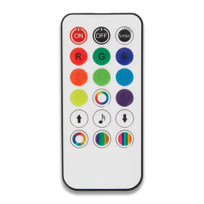
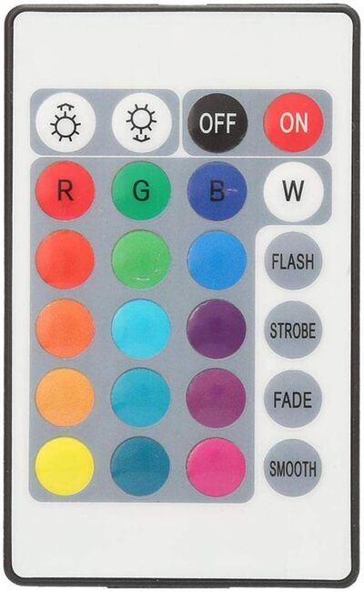

# LED Remote — Flipper Zero

Control an RGB LED strip with your Flipper Zero by learning IR codes from your physical remote.

## Features

- **Learn mode** — record each button from your physical IR remote
- **Remote mode** — navigate the button grid with the D-pad and press OK to send
- **Two remote layouts** — 18-keys (3×6) and 24-keys (4×6) depending on your LED strip controller
- **Multiple profiles** — up to 20 named profiles, one per LED strip or room
- **Two visual styles** — Circle (mimics the real remote) or Grid
- **LED feedback** — Flipper's RGB LED blinks the matching color while sending
- Supports all IR protocols decoded by Flipper (NEC, NECext, Samsung, …) and raw capture

## Usage

### First use — learn the buttons

1. Open the app → **Learn Buttons**
2. Select a button from the list (e.g. "Red")
3. Point your physical remote at the Flipper and press the matching button
4. The signal is captured automatically and the app returns to the list
5. Repeat for each button you want

Learned buttons are shown without `~` in the remote grid.

### Use the remote

1. Main menu → **Use Remote**
2. Navigate with the D-pad
3. Press OK to send the IR signal

### Profiles

Main menu → **Switch Profile** → select or create a profile.

Each profile stores its own set of learned buttons, saved to:
```
/ext/apps_data/led_remote/<type>_<profile_name>.ir
```

### Remote type

Main menu → **Remote Type** → choose between **18-Keys** and **24-Keys**.

Switching type reloads the button layout and its own saved file.

| 18-Keys | 24-Keys |
|:---:|:---:|
| [](./assets/18_keys.jpg) | [](./assets/24_keys.jpg) |

## Build

Requirements: [`mise`](https://mise.jdx.dev/) (manages ufbt automatically via `.mise.toml`)

```sh
mise install
```

### Compile

```sh
ufbt
```

The compiled app is at `dist/led_remote.fap`.

### Deploy over USB

```sh
ufbt launch
```

Compiles, copies the `.fap` to the Flipper and launches it immediately.

### Deploy via SD card

Copy `dist/led_remote.fap` to `apps/Infrared/` on the Flipper SD card.
