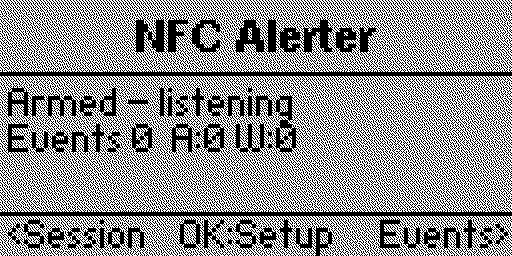
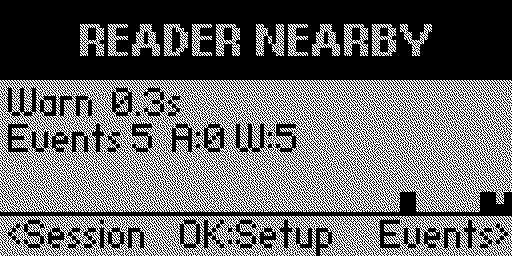
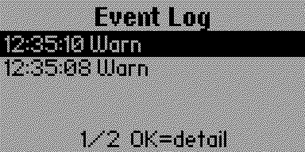
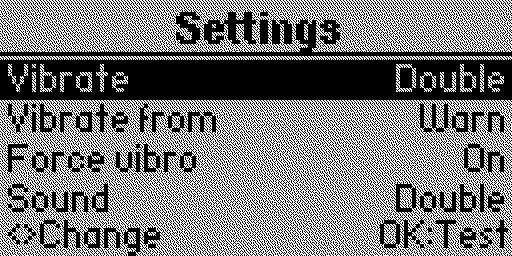

# NFC Canary

NFC scanner detection and alerter for when you're concerned about others
coming up and sniffing around your pockets, bags and gear. It's a
passive 13.56 MHz reader detector for Flipper Zero. 

## How to use:  
* Carry it in a pocket and if someone attempts to sniff your wallet or gear an alarm will go off 
* Put it inside your backpack to record how many things tried to NFC scan your bag in an airport 
* Any use you can think of where you want to know if someone or something is trying to scan you at 13.56MHz

## How does it work
Uses the ST25R3916's hardware External Field Detector: it listens for a
reader's carrier and never transmits anything of its own.

> **Detects readers, not tags.** A card, badge, or fob will *never* trigger
> this because passive tags have no transmitter. You need something that 
> emits/energizes a tag like a phone with NFC on (unlocked), or a
> payment/access terminal. Present it to the **back** of the Flipper.

| Armed | Reader detected |
|---|---|
|  |  |

| Event log | Settings |
|---|---|
|  |  |

## Install

**From a release:** download `nfc_canary.fap` from
[Releases](https://github.com/antitree/nfc_canary/releases) and copy it to
`/ext/apps/NFC/` on the Flipper's SD card (qFlipper's file manager works).
Then: **Apps → NFC → NFC Canary**.

**From source:** see [Build and deploy](#build-and-deploy).

## Quick start

1. Launch the app — the first run explains the tag-vs-reader distinction.
2. Press **OK** → **OK** to audition the alert so you know what to listen and
   feel for.
3. Press **Back** to arm it, and pocket the device.

To confirm it works, hold an unlocked Android phone with NFC enabled against
the **back** of the Flipper. Full procedure: [docs/TESTING.md](docs/TESTING.md).

## Build and deploy

```bash
./deploy.sh                # auto-detects the Flipper's serial port
./deploy.sh /dev/ttyACM0   # or name it
```
Then: **Apps > NFC > NFC Canary**

