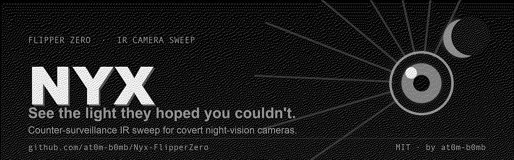
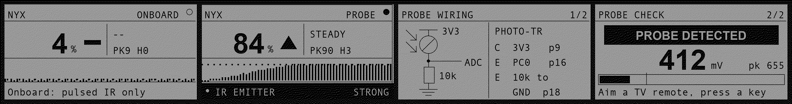

<div align="center">



# Nyx — Hidden-Camera / IR-Emitter Sweep for Flipper Zero

**See the light they hoped you couldn't.**

A covert night-vision camera has to light the room to see in it. It does that
with 850/940 nm infrared your eyes cannot register. Nyx turns that giveaway into
a meter you can walk around a hotel room or an Airbnb.

[](https://github.com/at0m-b0mb/Nyx-FlipperZero/actions/workflows/build.yml)
[](https://github.com/at0m-b0mb/Nyx-FlipperZero/releases/latest)
[](LICENSE)




</div>

---

## Read this first — what Nyx can and cannot see

This is the part most "hidden camera detector" apps quietly skip, and it is the
whole reason to trust or distrust a reading. Nyx is honest about it on the
device and here.

Nyx finds **IR emitters**, not cameras. A camera only shows up while it is
actively lighting the room with infrared. That is exactly what a night-vision
camera does in the dark — so Nyx is at its best doing a **lights-off sweep** of
a dark room, which is also when a covert camera is most likely emitting.

There is a second catch, and it comes from the Flipper's hardware.

### The two modes, and why there are two

| | **Onboard** (no extra hardware) | **Probe** (+ ~$1 phototransistor) |
|---|---|---|
| Sensor | Built-in **TSOP-75338** IR receiver | IR phototransistor on a GPIO ADC pin |
| Sees **steady** DC illuminators | ❌ **No** | ✅ **Yes** |
| Sees **pulsed / modulated** IR | ✅ Yes | ✅ Yes |
| Finds a typical night-vision camera | ⚠️ Only if it pulses its LEDs | ✅ **Yes** |
| Setup | Just run it | Wire a probe (2 min, see below) |

The Flipper's onboard IR receiver is a **demodulating** part: it has a band-pass
filter centred on 38 kHz and automatic gain control, built to pull TV-remote
codes out of a sunlit room. That filter **throws away steady light**. A covert
camera whose IR illuminator runs at constant DC current — very common — is
**invisible** to the onboard receiver no matter how bright it is. A clean `0` in
onboard mode does **not** mean the room is clean. Onboard mode still catches
anything *pulsed*: remotes, IR beacons and link ports, PIR sensor floodlights,
and illuminators driven by PWM.

To actually catch a **steady** illuminator you need a sensor without that
filter. That is what **Probe mode** is: a bare IR phototransistor on an ADC pin,
which reads DC light directly and can even tell a steady illuminator apart from
a mains-flickering lamp. It costs about a dollar and two minutes. If you are
serious about a sweep, wire the probe.

**Auto mode** uses the probe if one is plugged in, otherwise the onboard
receiver, and the header always tells you which one is live.

---

## Using it

1. **Sweep** — the meter, built around an **eye that watches back**. Kill the
   room lights, then pan the Flipper slowly across walls, smoke detectors, alarm
   clocks, vents, mirrors, and anything with a pinhole. The eye's **ring fills**
   and its **pupil dilates** as the signal rises, a tick marks your best reading
   so far, and the big **trend arrow** (▲ getting warmer / ▼ colder) points you
   in. When it locks on, glare spikes spin around the iris and the geiger clicks
   and LED speed up as you close in.
2. **Probe Setup** — how to wire the phototransistor, plus a **live check** so
   you can prove the probe works (aim a TV remote at it and watch the needle
   jump) before you trust a clean sweep.
3. **Settings** — mode, sensitivity, probe pin, and sound/vibro/LED. Your
   choices are **saved** and restored on the next launch.
4. **About** — the same honesty notes, on the device.

### Reading the source label

- **STEADY** — flat DC light. This is the **night-vision illuminator
  signature**. Probe mode only.
- **FLICKER** — ~100/120 Hz ripple. Riding the mains, so almost always a lamp,
  a heater, or a screen — not a camera.
- **PULSED** — faster modulation. A remote, a beacon, or a PWM-driven
  illuminator.

### Keys

| Key | Action |
|-----|--------|
| **OK** | Zero the peak-hold and hit count |
| **Hold OK** | Re-null the ambient baseline (probe mode) — do this after you walk into a new room |
| **← / →** | Flip between the wiring diagram and the live check on Probe Setup |
| **Back** | Leave the sweep / return to the menu |

---

## Building the probe (optional, but it's the real tool)

You need one part: an **IR phototransistor** — the dark-epoxy kind with a
daylight filter, sold for pairing with 940 nm IR LEDs — and one **10 kΩ**
resistor. It wires as an emitter-follower: more IR in, more volts out.

```
        3V3  (pin 9)
         │
        ┌┴┐   IR phototransistor
    IR →│ │   (collector to 3V3)
        └┬┘
         ├───────────►  ADC pin — PC0 (pin 16) by default
        ┌┴┐
        │ │  10 kΩ
        └┬┘
         │
        GND  (pin 18)
```

| Phototransistor lead | Wire to | Flipper pin |
|---|---|---|
| Collector | 3V3 | pin 9 |
| Emitter | ADC in + one end of 10 kΩ | **PC0, pin 16** |
| (10 kΩ other end) | GND | pin 18 |

You can pick any ADC-capable pin (PC0, PC1, PC3, PA4, PA6, PA7) under
**Settings → Probe pin**; the Probe Setup screen always shows the pin it expects
by its silkscreened number. Nyx detects the probe automatically by sensing the
load on the pin.

Then open **Probe Setup → →** and press a key on any TV remote pointed at the
phototransistor. If the reading jumps, you're good.

---

## Limits — please read

- **Nyx finds emitters, not cameras.** A camera sitting in a lit room (no IR
  needed) or switched off emits nothing, and Nyx will not see it. Do a
  **lights-off** sweep.
- **IR reflects.** A strong reading can be a bounce off a wall or mirror rather
  than the source. Move around; triangulate on the peak.
- **The world is full of IR.** Sunlight, incandescent and halogen bulbs, remote
  controls, and PIR sensors all emit it. Treat a hit as *a reason to look
  closely*, not as proof. Confirm with your eyes — most phone cameras (front
  cameras especially) see 850 nm IR as a faint purple glow, so cross-check by
  looking at the suspected source through a phone.
- Nyx is a **triage tool** to point you at things worth inspecting. It is not a
  guarantee, and no RF/IR gadget is.

---

## Install

**From a release (easiest)**

Download `nyx.fap` from the [latest release](https://github.com/at0m-b0mb/Nyx-FlipperZero/releases/latest)
and drop it in `apps/Infrared/` on your Flipper's SD card (qFlipper, or the
mobile app). It shows up under **Apps → Infrared → Nyx**. Works on stock
firmware — no custom firmware required.

**From source**

```bash
python3 -m pip install --upgrade ufbt
ufbt update            # pull the SDK (release channel)
git clone https://github.com/at0m-b0mb/Nyx-FlipperZero.git
cd Nyx-FlipperZero
ufbt                   # builds dist/nyx.fap
ufbt launch            # build + install to a connected Flipper
```

Regenerate the art after editing the generators:

```bash
python3 tools_gen_icons.py
python3 tools_gen_banner.py
python3 tools_gen_mockups.py
```

---

## How it works

- **`helpers/ir_sense.c`** — the dual-path engine, on a worker thread.
  - *Onboard:* `furi_hal_infrared_async_rx_*` with a capture ISR that counts
    output edges per window. Edge-rate is the activity metric; we never decode,
    because we don't care *what* is transmitted, only *that* something is.
  - *Probe:* `furi_hal_adc_*` sampling a dense 32 ms burst each window, reduced
    to mean level (nulled against the ambient baseline captured at arm time),
    peak-to-peak ripple, and a mean-crossing ripple frequency that separates a
    steady illuminator from mains flicker. Oversampling is deliberately **off**
    so the ripple survives.
  - The probe pin list is built from the SDK's own `gpio_pins[]` ADC table, so
    it can't drift from the HAL.
- **`views/sweep_view.c`** — the locating instrument: an eye whose ring fills
  with the live level, whose pupil dilates as you close in, with a peak tick, a
  source label, a get-warmer trend arrow, and an inverted alarm strip when an
  emitter is locked on. In onboard mode it keeps admitting, in the idle hint
  line, that it can only see pulsed IR.
- **`views/probe_view.c`** — the wiring schematic and the live probe check.
- **`views/splash_view.c`** — the boot intro: a Nyx eye opening through IR
  wave-rings (any key skips it).
- **`helpers/nyx_store.c`** — settings persistence via the firmware's
  `saved_struct`, so mode / sensitivity / probe pin survive a relaunch.
- **`scenes/`** — splash / start / sweep / probe / settings / about, wired with
  the standard Flipper scene-manager X-macro.

**Listen-only.** Nyx never transmits IR.

---

## Credits & license

Built by [**at0m-b0mb**](https://github.com/at0m-b0mb). MIT licensed — see
[LICENSE](LICENSE).

Part of a family of Flipper counter-surveillance tools:
[Specter](https://github.com/at0m-b0mb/Specter-FlipperZero) (NFC reader sweep),
[Argus](https://github.com/at0m-b0mb/Argus-FlipperZero) (Wi-Fi deauth detector),
[GhostTag](https://github.com/at0m-b0mb/GhostTag-FlipperZero) (BLE tracker hunter).

> Use Nyx to protect your own privacy and only in spaces you are entitled to
> sweep. You are responsible for complying with local law.
