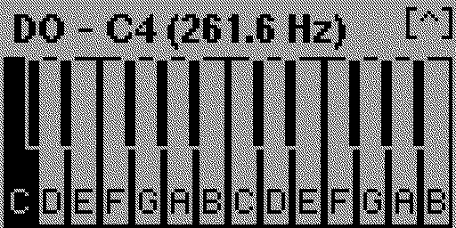
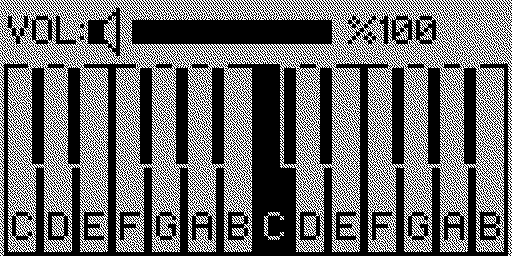

# 🎹 FlipPiano

14-key 2-octave mini piano application for **Flipper Zero**. 

play any song you want with a simple, handy mini piano app

---

## screenshots from the app

  
----------
  

---

<!-- Badges -->

---

##  Controls

| Button | Action |
| :--- | :--- |
| **Up / Down** | open/close volume menu |
| **Left / Right** | navigate piano keys |
| **OK** | play selected note |
| **Back** | exit |

---

