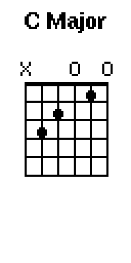
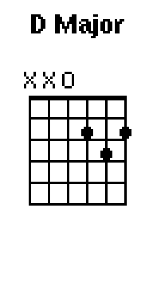
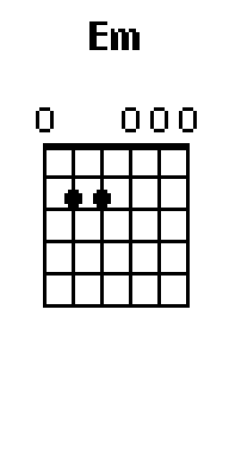

# 🐬 Flipper Pocket Chords

For beginner to intermediate guitar players, the Flipper Pocket Chords app can now be a chord reference diagram right in your pocket. All you need is a guitar and a Flipper Zero device.

## 🚀 Features 
* **Root Chords First** - Displays all major root chords from C to B.
* **Easy to Use for Beginner Guitar Players** - In portrait mode, using the up/down keys cycle through chord variations.
* **Practical and Helpful** - For right handed guitar players, the Flipper sits in front of guitar to help visualizing the chord on the guitar neck.

## Screenshots

## 📋 Prerequisites & Requirements
Before installing, ensure your environment meets these specifications:
* **Hardware:** Flipper Zero by Flipper Devices Inc.
* **Firmware:** Compatible with Official Firmware 1.4.3.
* **Software Tools:** qFlipper desktop application or mobile device with Flipper app installed.

## 🛠️ Installation

### Method 1: Via Mobile iOS app Flipper
1. Search for `Pocket Chords` in the Flipper app.
2. Make sure your Flipper is connected via bluetooth and click the `Install` button.

### Method 2: Via Web/qFlipper (Recommended for Users)
1. Download the compiled `.fap` file from the **[Releases](https://github.com)** page.
2. Open the **qFlipper** application on your machine.
3. Navigate to the SD Card tab -> `apps/` directory (choose the correct category like `Tools`).
4. Drag and drop the `.fap` file into the folder.

## 🎮 How to Use
Provide step-by-step instructions on how to use your tool once loaded onto the Flipper.

1. Navigate to **Apps** -> **[Tools]** -> **[Pocket Chords]**.
2. **Controls:** (Flipper Portrait Mode) 
   * **Left/Right:** Navigates the major chord roots.
   * **Up/Down:** Displays popular chord variations such as minor, major7 and more.
   * **OK Button:** n/a.
   * **BACK Button:** Exits the application.

## 💡 Future Plans
1. Find a purpose for Center Button (currently useless).
2. Consider building start menu or other options menu (e.g. choose portrait or landscape mode).
3. Center button could cycle through displaying each note per chord.

## 🤝 Contributing
Contributions are welcome!
1. Fork the Project.
2. Create your Feature Branch (`git checkout -b feature/AmazingFeature`).
3. Commit your Changes (`git commit -m 'Add some AmazingFeature'`).
4. Push to the Branch (`git push origin feature/AmazingFeature`).
5. Open a Pull Request.

## 📄 License
Distributed under the MIT License. See `LICENSE` for more information.
