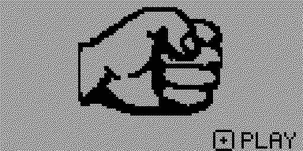
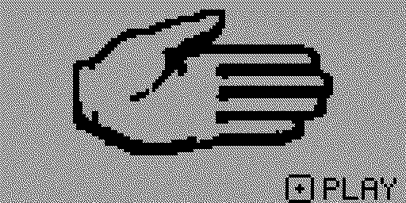
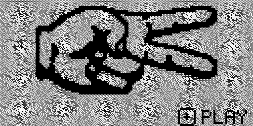

# Rock Paper Scissors for Flipper Zero

A minimal rock-paper-scissors game with large, hand-crafted 1-bit pixel art for
the Flipper Zero LCD.

## Screenshots

| Rock | Paper | Scissors |
| --- | --- | --- |
|  |  |  |

## Features

- Automatic rock-paper-scissors animation when the app opens
- A new random result every time you press OK
- Three reference-based monochrome bitmap sprites
- Minimal interface with a single PLAY hint

## Controls

- `OK`: Play again
- `BACK`: Exit

## Target

- Hardware target: Flipper Zero (`7`)
- Compatible with the latest official release and development SDKs
- Tested on Momentum `mntm-dev`, firmware API `87.1`

## Build

Use uFBT with a compatible Flipper Zero SDK:

```powershell
$env:UFBT_HOME = "C:\UFBT"
ufbt
```

The compiled app is written to `dist/pixel_rps.fap`.

## Install and launch

Close qFlipper, connect the device over USB, then run:

```powershell
$env:UFBT_HOME = "C:\UFBT"
ufbt launch
```

The app is installed to `/ext/apps/Games/pixel_rps.fap`.

## License

Rock Paper Scissors is released under the [MIT License](LICENSE).
