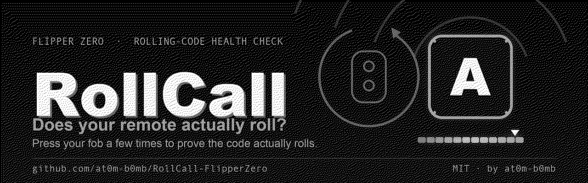
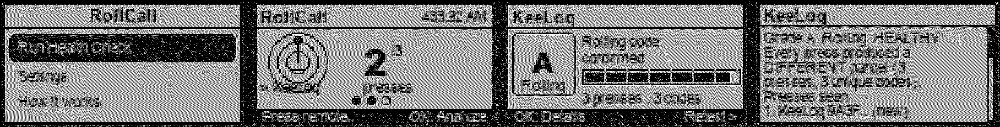
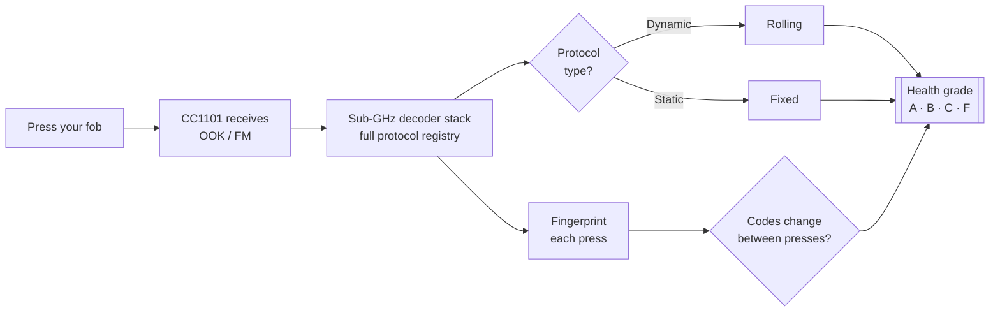

<div align="center">



# RollCall

**Rolling-code health check for your own key fobs, garage & gate remotes.**

Press your remote a few times — RollCall decodes each press, tells you whether it's a **rolling code** or a **static fixed code**, and *proves* whether the code actually advances between presses. Read-only. It never transmits, replays or clones.

[](https://github.com/at0m-b0mb/RollCall-FlipperZero/actions/workflows/build.yml)


-8a2be2)


</div>

---

## What it does

Most garage doors, gates, alarms and car remotes talk over Sub-GHz radio (315 MHz in the US, 433.92 MHz in the EU). Two very different things share those airwaves:

- 🟢 **Rolling code** — a *fresh* parcel every press (KeeLoq, Nice Flor‑S, CAME Atomo, Security+ 2.0…). Record one press and it's already useless: the counter has rolled forward. This resists replay attacks.
- 🔴 **Fixed / static code** — the *same* parcel forever (Princeton, CAME, Nice FLO, Holtek…). Record one press, replay it any time, and the receiver obeys. Trivially cloneable.

**RollCall tells you which one you're holding — and doesn't just take the protocol's word for it.** It fingerprints each press and confirms on the air whether the code actually changes. A remote that *claims* to roll but never advances is flagged too.

<div align="center">



*Main menu · live capture with the signal row · Find My Remote · the verdict · the full breakdown*

</div>

---

## The health grades

| Grade | Meaning | What RollCall saw |
|:---:|---|---|
| **A** | ✅ Healthy | Rolling protocol **and** every press produced a different code |
| **B** | 🟢 Likely OK | Rolling protocol; code changed, but needs a couple more presses for a clean climb (or only one press captured) |
| **C** | 🟡 Caution | Rolling protocol, but the code **didn't change** across presses — retest with a ~1s pause; if it never moves, the fob may be faulty or a static clone |
| **F** | 🔴 At risk | **Fixed** code — identical every press, replayable by anyone who records it once |
| **?** | ⚪ Unknown | A signal was decoded but couldn't be classified — try another band or modulation |

---

## How it works



RollCall drives the Flipper's internal **CC1101** in receive-only mode and runs the firmware's own Sub‑GHz decoder stack. Every decoded press yields:

1. **The protocol** and whether the firmware classifies it as *static* or *dynamic*.
2. **A fingerprint** — a hash of the decoded parcel (key + rolling counter). Identical presses hash the same; an advancing counter hashes differently.

A held button re-sends the same frame many times, so RollCall collapses repeats into a single **press** and only registers a new one when the parcel changes *or* enough quiet time passes for a real re‑press. That's what lets it count presses honestly for fixed **and** rolling codes, and prove — on the air — whether the code climbs.

> **No extra hardware.** RollCall uses only the Flipper's built‑in sub‑GHz radio.

---

## Find My Remote — stop guessing the frequency

A remote that produces nothing is almost always a remote on a band you aren't listening to. **Find My Remote** settles it: hold your fob down and RollCall sweeps every band it supports, measuring how far each one climbs above *its own* noise floor. The band your remote actually transmits on towers over the rest.

```
Find Band                    14 sweeps
──────────────────────────────────────
                    ▁
   ▁     ▂       ▃  █  ▂
  ─┴──┴──┴──┴──┴──┴──█──┴──┴──┴──┴──┴─
433.92 MHz  +48dB
[ OK: use this band            Back ]
```

Press **OK** and it adopts that band, saves it, and drops straight into the health check. It only ever reports a band that genuinely beat its floor — no signal means no answer, never a guess.

---

## Supported bands & protocols

- **Bands:** 300 · 303.87 · 310 · 315 · 318 · 330 · 345 · 390 · 418 · 433.92 · 434.42 · 434.77 · 868.35 · 915 MHz (whatever your radio allows)
- **Modulation:** AM650 / AM270 (covers most fobs) · FM238 / FM476 (Somfy, Security+ 2.0…)
- **Protocols:** everything in the Flipper's built‑in registry — rolling (KeeLoq, Nice Flor‑S, CAME Atomo, Star Line, Security+ 2.0, Somfy…) and fixed (Princeton, CAME, Nice FLO, Holtek, Linear, Hörmann…). Classification comes straight from the firmware decoders, so it tracks upstream.

> RollCall reads no manufacturer keys and needs none — telling *rolling from fixed* doesn't require decrypting anything.

---

## Install

### Option A — qFlipper (easiest)

1. Download `rollcall.fap` from the [latest release](https://github.com/at0m-b0mb/RollCall-FlipperZero/releases) (or build it, below).
2. Open **qFlipper** and connect your Flipper Zero.
3. Drag `rollcall.fap` into **SD Card → `apps` → `Sub-GHz`**.
4. On the Flipper: **Apps → Sub-GHz → RollCall**.

### Option B — Build & launch with ufbt

```bash
python3 -m pip install --upgrade ufbt   # one-time
git clone https://github.com/at0m-b0mb/RollCall-FlipperZero.git
cd RollCall-FlipperZero
ufbt                                     # builds dist/rollcall.fap
ufbt launch                              # installs + opens it on a connected Flipper
```

### Option C — Manual SD card

Copy `dist/rollcall.fap` to `apps/Sub-GHz/` on the Flipper's microSD, then open it from **Apps → Sub-GHz → RollCall**.

---

## Using it

1. **Settings** → pick your **Band** (315 US / 433.92 EU) and **Modulation** (start with AM650). Set how many **Presses** to sample (default 3). Settings persist between launches.
   *Don't know your band? Run **Find My Remote** instead and let it find one.*
2. **Run Health Check.**
3. Point your remote at the Flipper and **press it a few times, pausing ~1 second** between presses. The slots fill as each press lands.
4. Read the **grade**. Press **OK** for the full breakdown — the per‑press ledger shows each code fingerprint, bit length, signal strength, and whether it was `new` or the `same`.
5. **Retest ›** runs another pass; **Back** returns to the menu.

### Nothing being detected?

The signal row along the bottom of the check screen tells you *which* problem you have, instead of leaving you staring at a zero:

| What you see | What it means | Fix |
|---|---|---|
| Bar flat, pip dark | Nothing on this frequency at all | Run **Find My Remote** — it sweeps every band and points at yours |
| Bar jumps, pip lights, counter stays `0` (`RF seen, no decode`) | Right frequency, but the frames aren't being decoded | Change **Modulation** — AM270 for narrow fobs, FM238/FM476 for FSK ones |
| One press counted twice, or two presses counted as one | The press-collapsing window doesn't match your fob | Adjust **Press gap** in Settings (0.25 s – 1.5 s) |

The **pip** on the left of the signal row lights when the demodulator is producing raw pulses — that's how you tell "wrong frequency" apart from "right frequency, protocol I can't decode".

---

## Safety, ethics & legal

- **Listen-only by design.** RollCall never transmits, replays, jams or clones. It decodes what's already in the air and classifies it.
- **Test only what you own** or are explicitly authorised to assess. Intercepting others' remotes may be illegal where you live.
- This is an **educational, defensive** tool: know whether your own remote resists replay *before* someone else finds out it doesn't.

---

## Build from source

Requires [ufbt](https://pypi.org/project/ufbt/). Assets are regenerated with Pillow.

```bash
ufbt                       # build dist/rollcall.fap
python3 tools_gen_icons.py    # 10px app icon
python3 tools_gen_banner.py   # README banner + social preview
python3 tools_gen_mockups.py  # screen mockups
```

The grading brain and the dump parser are pure logic, so they're tested on the host under ASan/UBSan — no Flipper needed:

```bash
make -C test
```

```
RollCall-FlipperZero/
├── application.fam          # app manifest (Sub-GHz, fap_libs=["subghz"])
├── rollcall.c / rollcall_i.h
├── helpers/
│   ├── rc_radio.c/.h        # CC1101 + decoder stack, live RSSI, band hunt
│   ├── rc_settings.c/.h     # persisted band/modulation/press settings
│   ├── rc_parse.c/.h        # pure text parsing over decoder dumps
│   └── analyzer.c/.h        # pure grading logic (no radio, no UI)
├── views/
│   ├── capture_view.c/.h    # animated "listening" screen + signal row
│   ├── hunt_view.c/.h       # per-band bar chart for Find My Remote
│   └── verdict_view.c/.h    # hero grade card
├── scenes/                  # start · capture · hunt · verdict · details · settings · about
└── test/                    # host tests (make -C test)
```

---

<div align="center">

**RollCall** · by [at0m-b0mb](https://github.com/at0m-b0mb) · MIT License

*Know your own doors before someone else does.*

</div>
