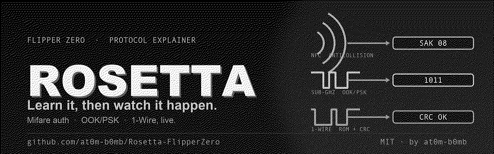
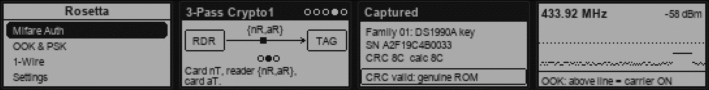
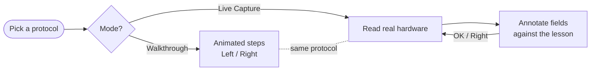

<div align="center">



# Rosetta

**Learn the protocol. Then watch it happen.**

Rosetta is a **protocol explainer** for the Flipper Zero. It runs animated, step‑by‑step walkthroughs of how **Mifare Classic authentication**, **OOK/PSK modulation**, and **1‑Wire** actually work on the wire — then drops you into a **live capture‑and‑annotate** mode that reads real hardware and labels every field against the lesson you just watched.

[](https://flipperzero.one/)
[](https://github.com/at0m-b0mb/Rosetta-FlipperZero/actions)
[](#)
[-2EDC82?style=flat-square)](#)
[](LICENSE)
[](https://github.com/at0m-b0mb)

</div>

---

## The idea

Most Flipper tools *do* the thing — read a card, replay a signal, dump a key. Rosetta is different: it **shows you why the thing works**. It's the Rosetta Stone for the protocols hackers touch every day, turning three intimidating specs into short, animated stories you can actually follow — and then proving them on real silicon in your hand.

> **Read‑only, always.** Rosetta never writes to a tag, never authenticates, never cracks a key, and never transmits. Live capture only reads what any reader already sees.

<div align="center">

<br>
<sub><b>Menu → Walkthrough → Live Capture.</b> Watch the protocol animate, then capture the real thing and read the annotated fields.</sub>
</div>

---

## What's inside

Three protocols, each with an **animated walkthrough** and a **live capture** that ties straight back to it:

| Protocol | Walkthrough (animated) | Live capture (real hardware) |
|---|---|---|
| 🔐 **Mifare Auth** | RF field & ATQA → anticollision → auth request → the **3‑pass Crypto1** handshake → why it's been broken since 2008 | Reads a card's **anticollision** (UID / SAK / ATQA) — exactly the exchange that happens *before* Crypto1 |
| 📡 **OOK & PSK** | The carrier → **On‑Off Keying** → **Phase‑Shift Keying** → slicing the envelope back into bits | A live **Sub‑GHz RF envelope scope** — watch real OOK bursts break the carrier threshold |
| 🧵 **1‑Wire** | One line & parasite power → reset/presence → write slots → read slots → the **64‑bit ROM** | Reads a real **iButton ROM** and validates the **Maxim CRC‑8 on‑device** |

### The Mifare Classic story, animated

```
  RDR  ── AUTH 0x60 ─▶  TAG      1. Reader asks to auth a block with Key A
  RDR  ◀──── nT ─────  TAG      2. Card sends its (weak) nonce
  RDR  ── {nR,aR} ──▶  TAG      3. Reader answers, encrypted under Crypto1
  RDR  ◀──── aT ─────  TAG      4. Card confirms — both now share a keystream
       🔓  keys in seconds       5. Weak nonce + linear Crypto1 = nested/darkside
```

Every step is a live diagram on the Flipper's screen — moving packets, a handshake that cycles through its three legs, a padlock that pops open when the attack lands. **Left / Right** walk through the steps; the animation loops on its own.

---

## Live capture‑and‑annotate

Pick **Live Capture** on any protocol and Rosetta reads the real thing, then labels the bytes:

- **NFC (Mifare)** — hold a 13.56 MHz card to the back. Rosetta shows the **technology**, the **UID**, and the **SAK / ATQA** — the anticollision every reader sees before it even *attempts* Crypto1. A 4‑byte UID is flagged as trivially cloneable.
- **1‑Wire (iButton)** — touch a Dallas key to the pads. Rosetta issues `READ ROM (0x33)`, splits the 64 bits into **family / 48‑bit serial / CRC**, recomputes the **Maxim CRC‑8** on‑device and tells you whether it matches — proof the ROM is genuine.
- **Sub‑GHz (OOK/PSK)** — park on a frequency (433.92 by default) and watch a live **RSSI envelope**. When the trace pokes above the adaptive threshold line, that's a **carrier‑ON / OOK burst** — the modulation from the walkthrough, happening for real.



> **Honest by design.** The NFC mode reads activation data only — it does **not** sniff or crack a Crypto1 session. The RF mode is an RSSI envelope, not a full demodulator. Rosetta teaches the protocol; it doesn't pretend to attack it.

---

## Install to your Flipper Zero

Rosetta is a standard external app (`.fap`) in the **Tools** category. Pick whichever route you like.

### Option A — Prebuilt `.fap` (fastest)

1. Grab `rosetta.fap` from the [**Releases**](https://github.com/at0m-b0mb/Rosetta-FlipperZero/releases) page, or from the latest green run under [**Actions**](https://github.com/at0m-b0mb/Rosetta-FlipperZero/actions) → *Artifacts*.
2. Open [**qFlipper**](https://flipperzero.one/update) and connect your Flipper.
3. Copy `rosetta.fap` to the SD card at **`SD Card / apps / Tools /`**.
4. On the Flipper: **Apps → Tools → Rosetta**.

### Option B — Build & install over USB (one command)

With [`ufbt`](https://pypi.org/project/ufbt/) installed and your Flipper plugged in:

```bash
git clone https://github.com/at0m-b0mb/Rosetta-FlipperZero.git
cd Rosetta-FlipperZero
ufbt launch          # builds and installs straight onto the Flipper, then opens it
```

### Option C — Custom firmware app catalogs

The source is drop‑in compatible with the app‑catalog layout used by **Momentum** / **Unleashed** / **RogueMaster**. Drop the folder into `applications_user/rosetta` and build, or install from their in‑firmware app hubs where listed.

> **Compatibility:** built against official firmware **fw 7 / API 87.1**. It uses only public `lib/nfc`, `lib/subghz` and `lib/one_wire` APIs, so it tracks current release and dev SDKs.

---

## Using it

- **Walkthrough** — **Left / Right** (or **OK**) move between steps; the diagram animates continuously. Step pips at the top‑right show where you are. **Back** returns to the menu.
- **Live Capture (NFC / iButton)** — present the tag; the fields appear with a verdict banner. **OK / Right** captures another; **Back** exits.
- **Live Capture (RF)** — the envelope scrolls live. **Back** exits. Change the frequency in **Settings → RF Freq** (433.92 / 315 / 868.35 / 915).
- **Settings** — toggle **Sound**, **Vibro** and **LED** feedback, and pick the RF scope frequency.

---

## Build from source

```bash
# one-time: install the micro Flipper build tool
python3 -m pip install --upgrade ufbt
ufbt update                     # sync the SDK

# from the repo root
ufbt                            # -> dist/rosetta.fap
ufbt launch                     # build + install + run on a connected Flipper
```

Regenerate the artwork (optional, needs Pillow):

```bash
python3 tools_gen_icons.py      # 10x10 app icon
python3 tools_gen_banner.py     # GitHub banner + social card
python3 tools_gen_mockups.py    # README screen mockups
```

---

## Project layout

```
Rosetta-FlipperZero/
├─ application.fam              # app manifest (appid, Tools category, icon)
├─ rosetta.c / rosetta_i.h      # app lifecycle, views, notifications
├─ helpers/
│  ├─ protocols.[ch]            # the three lessons: titles, step count, captions
│  ├─ nfc_reader.[ch]           # read-only NFC anticollision (UID / SAK / ATQA)
│  ├─ onewire_reader.[ch]       # iButton READ ROM + on-device Maxim CRC-8
│  └─ rf_scope.[ch]             # live Sub-GHz RSSI envelope sampler
├─ views/
│  ├─ lesson_view.[ch]          # the animated walkthrough renderer (the star)
│  ├─ capture_view.[ch]         # "present a tag" + annotated result card
│  └─ scope_view.[ch]           # scrolling RF envelope scope
├─ scenes/                      # start · protocol · lesson · capture · settings · about
├─ icons/                       # 1-bit app icon (fbt-compiled)
├─ images/                      # banner, social card, screen mockups
└─ tools_gen_*.py               # Pillow asset generators
```

---

## FAQ

**Does it crack Mifare keys or clone cards?** No. Rosetta reads activation data only (UID / SAK / ATQA). It never runs nested/darkside, never tries keys, never writes or emulates. The walkthrough *explains* the attack; the app doesn't perform it.

**Does the RF scope decode signals into bytes?** No — it's an RSSI **envelope**, which is exactly what OOK modulation looks like over time. It's a teaching scope, not a demodulator. For real capture/replay use the stock **Sub‑GHz** app.

**Live iButton read says CRC mismatch.** Re‑seat the key on the pads and try again — a poor contact clocks in garbage. A genuine, well‑seated key returns a CRC that matches the recomputed one.

**My NFC capture shows no UID.** Rosetta pulls the UID on the ISO14443‑A family (Classic, DESFire, Ultralight/NTAG, Plus, ISO‑DEP‑A — the bulk of access cards). Other air interfaces still show the detected technology.

**Where's the antenna?** NFC is on the **back** of the Flipper; iButton is the **two pads** on the top edge; Sub‑GHz uses the internal CC1101.

---

## Ethics & legal

Rosetta is an **educational, defensive** tool: understand the protocols so you can reason about their security. Only capture tags, keys and signals you **own or are explicitly authorised to test**. It performs no attack and stores no data — but you are responsible for using it lawfully. Don't be a jerk.

---

## Credits

Built by **[at0m-b0mb](https://github.com/at0m-b0mb)**. Part of a family of Flipper Zero security tools:

- 🛡️ **[Warden](https://github.com/at0m-b0mb/Warden-FlipperZero)** — NFC access‑card security grader
- 🔱 **[Trident](https://github.com/at0m-b0mb/Trident-FlipperZero)** — 3‑in‑1 ESP32 + NRF24 + CC1101 multi‑radio
- 👻 **[Specter](https://github.com/at0m-b0mb/Specter-FlipperZero)** — passive NFC reader/skimmer bug‑sweep
- 📡 **[Cerberus](https://github.com/at0m-b0mb/flipper-cerberus)** — Sub‑GHz RF watchdog
- 🏷️ **[GhostTag](https://github.com/at0m-b0mb/GhostTag-FlipperZero)** — anti‑stalking BLE tracker hunter

<div align="center">
<sub>MIT © 2026 at0m-b0mb — Flipper Zero and the dolphin are trademarks of Flipper Devices. Rosetta is an independent project.</sub>
</div>
