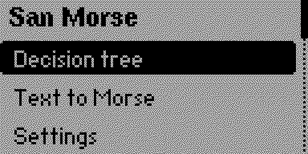
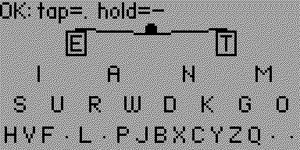

# San Morse — Flipper Zero

A Morse code app designed for learning while you write: it shows the Morse
**decision tree** on screen as a guide, instead of requiring you to know the
codes beforehand. It also converts text to Morse and plays it back.

The interface is **English by default**, with Spanish available as an option
(Settings → Language).




## Modes

### Decision tree
The full dichotomic Morse tree is drawn on screen (E/T → I/A/N/M → …) and the
**OK button works as a telegraph key**: while you hold it the tone plays and
the LED lights up, and on release the symbol is decided by press duration:

| Button | Action |
|---|---|
| OK quick release (<250 ms) | dot (·) — descend to the left branch |
| OK held | dash (−) — descend to the right branch |
| *~1.5 s pause* | commits the current node's letter (automatic) |
| *~4 s pause* | adds a space (automatic) |
| ◄ Left | commit the letter now, without waiting |
| ► Right | play back what you have written, in Morse |
| ▲ Up | undo the last symbol; at the root, delete the last letter |
| ▼ Down | manual space |
| Back | cancel the current letter; again to exit to the menu |

The current node is shown inverted and its two children framed, so you always
see which character the next dot or dash would give you. While holding OK, the
symbol in the top-right corner switches from `·` to `−` when you cross the
threshold, and a bar under the text shows the countdown to commit the letter
(solid line) or the space (dotted line).

**Numbers and signs** live on level 5 of the tree (`2 = ··−−−`, `7 = −−···`…).
When you reach level 4 the view zooms into the subtree and shows them: digits
0–9 and the signs `& + = / (` hang from the fourth-level positions (including
the ones with no Latin letter, drawn as dots).

### Text to Morse
Type a text with the Flipper keyboard and it is played back with **sound, LED
and vibration**, highlighting the current character and symbol on screen.

During playback:

| Button | Action |
|---|---|
| OK | pause / resume / replay |
| ▲ / ▼ | speed (5–35 WPM) |
| ◄ | sound on/off |
| ► | vibration on/off |
| Back | stop and return |

### Settings
From the menu, persisted to the SD card (`apps_data/san_morse`):

| Setting | Values |
|---|---|
| Language | English (default) / Español |
| Sound / Vibration / LED | on / off |
| Volume | 25–100 % |
| Tone | 440–800 Hz |
| Speed | 5–35 WPM |
| Dash threshold | 150–400 ms (how long to hold OK for a dash) |
| Commit letter | OFF (manual only, with ◄) or 0.8–3 s |
| Auto space | OFF or 2–8 s |

## Building

```bash
pip install --user ufbt
cd san-morse-flipper
ufbt          # produces dist/san_morse.fap
```

With the Flipper connected over USB: `ufbt launch` (builds, installs and opens
the app). You can also copy `dist/san_morse.fap` to the SD card under
`apps/Tools/`.

> Built against the official (release) firmware. If you run a custom firmware
> (Momentum, Unleashed…), point ufbt at its SDK, e.g.:
> `ufbt update --index-url=https://up.momentum-fw.dev/firmware/directory.json`
