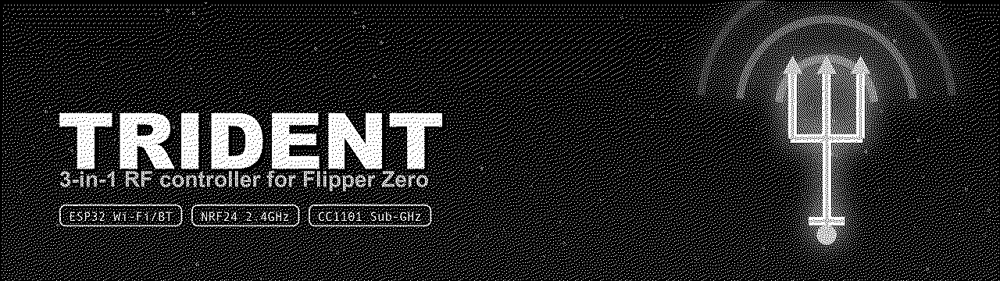
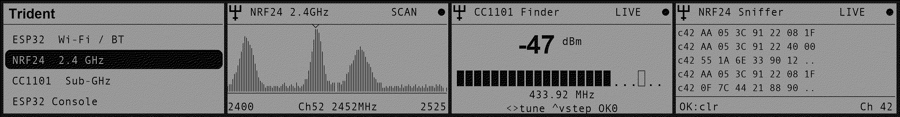

<p align="center">
  
</p>

<h1 align="center">Trident</h1>

<p align="center">
  <b>One control surface for a 3-in-1 ESP32 + NRF24 + CC1101 expansion board.</b><br>
  Wi-Fi &amp; Bluetooth, a 2.4&nbsp;GHz analyzer / finder / sniffer, and a Sub-GHz sweep &amp; frequency finder — from a single Flipper Zero app.
</p>

<p align="center">
  
  
  
  
</p>

<p align="center">
  
</p>

---

## What it is

A single Flipper Zero application that drives all three radios on a 3-in-1
expansion board — no jumping between separate apps. The Flipper is the UI; the
board is the RF front-end. Each radio is driven with the most correct driver
available on the platform, so what you see on screen reflects real hardware.

| Radio  | Bus            | What Trident does                                             |
| ------ | -------------- | ------------------------------------------------------------- |
| ESP32  | GPIO UART      | Full ESP32 **Marauder** controller — Wi-Fi/BT/GPS + live console |
| NRF24  | External SPI   | **2.4 GHz** spectrum analyzer, channel finder & sniffer        |
| CC1101 | Sub-GHz device | **Sub-GHz** band sweep + frequency finder (internal / external) |

---

## Features

### 📡 ESP32 — Wi-Fi / Bluetooth / GPS

A polished front-end for an ESP32 running the
[Marauder](https://github.com/justcallmekoko/ESP32Marauder) firmware, spoken
over the Flipper's GPIO UART at 115200 baud.

- **Wi-Fi** — scan APs & stations, channel analyzer, set channel, targeting/select,
  sniffers (beacon / probe / deauth / PMKID / pwnagotchi / ESP / raw)
- **Attacks** (gated behind a confirmation) — deauth, beacon spam (list / random / AP),
  probe flood, Rickroll, **Evil Portal**
- **Bluetooth** — sniff BT, skimmer detect, AirTag scan, and BLE Spam
  (Apple / Samsung / Google / Windows / all)
- **GPS** — live GPS data and AP / station wardriving
- **Device** — command help, board settings, clear lists, SD update, reboot
- **Console** — a live serial terminal that speaks any raw Marauder command, so
  Trident stays useful across firmware revisions

### 📶 NRF24 — 2.4 GHz

Read-only 2.4 GHz tooling built on the nRF24L01+. Three modes:

- **Spectrum Analyzer** — sweeps all 126 channels (2400–2525 MHz), sampling the
  Received Power Detector, and renders a live bar spectrum with peak-hold
- **Channel Finder** — camp one channel and read its hit-rate on an analog gauge,
  with Geiger-style audio feedback (`◀ ▶` channel, `▲ ▼` ±10, `OK` zero)
- **Sniffer** *(experimental)* — promiscuous capture on a channel (CRC off,
  preamble-as-address), printing each frame's leading bytes to a scrolling log
- Never transmits

### 📻 CC1101 — Sub-GHz

RSSI analysis across the common Sub-GHz bands, driven through the firmware's
tested Sub-GHz device layer.

- **Spectrum sweep** over **300–348**, **387–464** (covers 433) and
  **779–928 MHz** (covers 868/915), with a decaying max-hold and dBm peak readout
- **Frequency Finder** — camp any frequency on the signal meter; tune with
  `◀ ▶`, change the step (10 kHz … 10 MHz) with `▲ ▼`, one-touch presets for
  315 / 390 / 418 / 433.92 / 868.35 / 915 MHz, Geiger audio feedback
- Choose the **Internal** Flipper CC1101 or the board's **External** CC1101
  (the external radio needs a firmware that ships the `cc1101_ext` driver —
  Unleashed / RogueMaster / Momentum)
- Never transmits

### ✨ Everywhere

- Clean, branded UI with shared spectrum + analog-meter renderers
- **Settings are saved across runs** (UART pins, CC1101 radio, band, feedback)
- Sound / vibro / LED feedback, all toggleable; `OK` resets peak-hold anywhere

---

## Wiring

The Flipper side of the bus is fixed; match your board's pads to it. Only the
radio you are currently using needs to be wired.

**ESP32 (UART)** — set the pins in `Settings → ESP32 UART pins`

| Flipper pin | Signal |
| ----------- | ------ |
| 13 (TX) / 14 (RX) | standard wiring |
| 15 (TX) / 16 (RX) | alternate wiring |

**NRF24 (SPI)** — standard Flipper ↔ nRF24L01 mapping

| Flipper pin | NRF24 |
| ----------- | ----- |
| 2 (A7) | MOSI |
| 3 (A6) | MISO |
| 4 (A4) | CSN  |
| 5 (B3) | SCK  |
| 6 (B2) | CE   |
| 3V3 / GND | VCC / GND |

**CC1101** — no extra wiring for the **Internal** radio. For the **External**
CC1101, use the same GPIO wiring your firmware's Sub-GHz "external module"
expects (Trident drives it through the standard `cc1101_ext` device).

> Combined boards route these signals to fixed pads. Trident uses one radio at a
> time, so a shared CS between the CC1101 and NRF24 on such boards is not a
> conflict in practice.

---

## Install

### Download

Grab `trident.fap` from the latest CI run (Actions → Build FAP → Artifacts) or
build it yourself, then drop it in `apps/GPIO/` on your Flipper's SD card.

### Build from source

Requires [`ufbt`](https://github.com/flipperdevices/flipperzero-ufbt):

```bash
python3 -m pip install --upgrade ufbt
git clone https://github.com/at0m-b0mb/Trident-FlipperZero.git
cd Trident-FlipperZero
ufbt            # build dist/trident.fap
ufbt launch     # build, install and run on a connected Flipper
```

Regenerate the icons and marketing art (optional):

```bash
python3 tools_gen_icons.py     # icons/*.png
python3 tools_gen_banner.py    # images/banner.png, social-preview.png
python3 tools_gen_mockups.py   # images/screen_*.png, screens.png
```

---

## Usage

1. Open **Trident** from `Apps → GPIO`.
2. Pick a radio from the home screen:
   - **ESP32 Wi-Fi / BT** → scan, sniff, target, attack, wardrive, or open the console
   - **NRF24 2.4 GHz** → choose Spectrum Analyzer, Channel Finder or Sniffer
   - **CC1101 Sub-GHz** → choose a band sweep, or a Frequency Finder preset
3. On any analyzer or finder, **OK** resets the peak / activity hold; **Back** stops it.
4. Tune behaviour in **Settings** (UART pins, CC1101 radio, default band,
   attack confirmation, sound / vibro / LED). Settings persist across runs.

### Controls

| Screen           | Keys                                                    |
| ---------------- | ------------------------------------------------------- |
| Analyzers        | `OK` reset peak · `Back` exit                           |
| CC1101 Finder    | `◀ ▶` tune · `▲ ▼` step size · `OK` zero peak            |
| NRF24 Finder     | `◀ ▶` channel · `▲ ▼` ±10 · `OK` zero peak               |
| NRF24 Sniffer    | `◀ ▶` channel · `OK` clear log · `▲ ▼` scroll            |
| ESP32 Console    | `OK` send a command · `▲ ▼` scroll                      |

---

## Layout

```
trident.c                 app lifecycle, ESP32 link, command launcher
trident_i.h               shared app state + API
application.fam           app manifest (ufbt)
helpers/
  marauder.h              ESP32 Marauder command catalogue
  marauder_uart.[ch]      UART worker (line-oriented, 115200 8N1)
  nrf24_radio.[ch]        nRF24L01+ SPI driver — sweep / camp / sniff modes
  subghz_radio.[ch]       CC1101 worker — band sweep + frequency camp
  trident_storage.[ch]    persist settings across runs
views/
  console_view.[ch]       live text console (ESP32 serial + NRF24 sniffer log)
  spectrum_view.[ch]      shared analyzer bar-graph view
  meter_view.[ch]         shared finder gauge (segmented meter + readout)
scenes/                   start, esp32, wifi, attacks, bluetooth, gps, device,
                          nrf24 (scan/find/sniff), subghz (scan/find),
                          settings, about, …
```

---

## Legal & safety

Trident is for **authorised testing, education and RF exploration only**. Use it
on hardware, networks and radios that you own or have explicit permission to
assess. The ESP32 attack tools transmit and can disrupt nearby devices — they
are gated behind a confirmation, and enabling them is your responsibility. The
NRF24 and CC1101 tools are receive-only. Radio transmission is regulated; know
and follow the rules where you are.

---

## Credits

- ESP32 command set: the upstream [ESP32 Marauder](https://github.com/justcallmekoko/ESP32Marauder)
  CLI by *justcallmekoko*.
- Built with [`ufbt`](https://github.com/flipperdevices/flipperzero-ufbt) against
  the official Flipper Zero SDK.

Made by [**at0m-b0mb**](https://github.com/at0m-b0mb) · MIT licensed.
