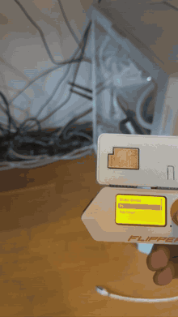

# wol-flipper

Wake-on-LAN for Flipper Zero, with a built in ESP flasher.

<p align="center">
  
</p>

The Flipper has no network stack, so the official ESP32-S2 WiFi dev board is used as
the network adapter. It runs a small companion firmware from this repo: the Flipper
sends one line over UART, the board joins Wi-Fi and puts the magic packet on the wire
as a UDP broadcast.

The app can also flash that firmware itself: dump whatever is currently on the ESP to the
SD card, write the WoL firmware, and put the old image back later. No PC needed after the
first setup.

## Why not ESP-AT or Marauder

Nothing in the usual dev board firmware zoo can send an arbitrary UDP datagram:
Marauder and Ghost ESP work at the link layer, Black Magic is a GDB server, FlipperHTTP
only speaks HTTP/WebSocket. ESP-AT can, but it does not fit the three fixed offsets a
Flipper side flasher writes to (its app lives at `0x60000` plus extra partitions), and
Espressif no longer publishes prebuilt S2 binaries for the WROVER module the dev board
uses. Hence the ~200 line companion firmware, which builds into exactly three files at
the offsets the flasher expects.

## Requirements

* Flipper Zero, firmware with the `furi_hal_serial` API (official 0.98+ / recent
  Momentum / Unleashed / RogueMaster). Built and checked against SDK API 87.1.
* Official Flipper WiFi dev board (ESP32-S2-WROVER) on the GPIO header.

## Install

Copy `dist/wol_flipper.fap` to `/ext/apps/GPIO/`. That is the whole install.

The companion firmware travels inside the .fap. fbt packs `fw/` into a `.fapassets`
section and the app loader unpacks it to `/ext/apps_assets/wol_flipper/` on launch, so
the flasher always has something to write. That section carries no ELF `ALLOC` flag, so
it never reaches RAM: the app itself is about 32 KB of `.text` + `.rodata`, the other
670 KB are streamed off the SD card. The first launch takes an extra moment while the
images are unpacked.

To flash a locally built firmware instead, drop `bootloader.bin`, `partitions.bin` and
`firmware.bin` into `/ext/apps_data/wol_flipper/fw/`. Files there win over the packed
ones.

The app appears under `Apps -> GPIO -> WoL Flipper`.

## First run

1. `ESP board -> Backup ESP flash`. Dumps the whole 4 MB chip to
   `/ext/apps_data/wol_flipper/backup/esp-YYYYMMDD-HHMMSS.bin`. Do this before
   overwriting Marauder or whatever else is on the board. The dump is bit exact and
   includes NVS, so `Restore backup` puts it back exactly as it was.
2. `ESP board -> Flash WoL firmware`. Writes the three images, MD5 verified, then resets
   the board into them. Three blue LED blinks mean the new firmware booted.
3. `ESP board -> Firmware check` confirms it answers.
4. `Wi-Fi setup -> Scan for networks` lists what the board's own radio can see and fills
   the SSID in from the list, which also rules out typos and invisible 5 GHz networks.
   Then set the key and save. `Test connection` checks the board actually associates.

   Up to 8 networks can be saved, so the same Flipper works at home and at the office.
   Nothing marks one of them as active: when several are saved, each wake asks the board
   what is on the air and takes the strongest match. An association that is already up to
   a saved network is reused, which skips the scan on repeat wakes.
5. `Targets -> Add target`:
   * `Name`: free text label
   * `MAC`: the target NIC's MAC, entered as 6 hex bytes
   * `Bcast`: a **broadcast** address, `255.255.255.255` by default. Not the target's
     own address: a sleeping host answers no ARP, so a unicast magic packet never gets
     a destination MAC and dies at the sender. The board always adds the subnet directed
     broadcast of its own network on top of whatever is set here
   * `Port`: cycles between 9, 7 and 0
6. `Wake device`, pick a target.

## Is the board alive

The firmware has no other visible output, so `RESET` on a correctly flashed board looks
exactly like nothing happening. Two ways to tell:

**The LED.** A red, green, blue self test at boot, then a short green blip every three
seconds while idle. Pulsing blue while a command runs, one green blink on success, three
red blinks on failure.

The RGB LED is on GPIO 4 (blue), 5 (green) and 6 (red), the same pins Marauder drives on
this board, and it is **common anode**: the pin has to go low to light the die. Driving
it the other way is not a subtle mistake, since every state then lands within a few
percent of full brightness and the board just glows. Both facts are baked into
`LED_ACTIVE_LOW` and the pin defines in `esp32/src/main.cpp`. Output goes through LEDC at
about 4 percent duty, because at full brightness this part is painful to look at; raise
`LED_LEVEL` if you need it visible in daylight.

The board runs off the Flipper's 5V rail, which the app switches on at launch and off
when it exits. Leaving the app therefore kills the LED and drops the board's Wi-Fi
association.

**`ESP board -> Firmware check`.** Sends a `PING` and reports the firmware version. It
never touches Wi-Fi and never needs bootloader mode, so it separates a dead board from
bad credentials:

* `Firmware vN alive`: the board is running this firmware
* `Wrong ESP firmware`: something answers on the UART, but it is not this firmware
* `No answer from board`: nothing answers: not flashed, not seated, or not powered

Bootloader mode is entered automatically. The official dev board routes the ESP32-S2
reset and strapping lines to header pins 7 (PC3, DTR) and 6 (PB2, RTS), so the flasher
runs the esptool reset dance itself, and resets the board again when it is done writing.
Third party boards usually leave those pins unconnected; there the old ritual still
applies, **hold BOOT, tap RESET, release BOOT**, and the app says so when it gets no
answer.

Settings live in `/ext/apps_data/wol_flipper/wol.cfg`, including the Wi-Fi password in
plain text. The companion firmware itself stores no credentials: they arrive with every
request, so a flash dump never contains them.

## Speed and safety notes

* The flasher connects at 115200, uploads the esptool stub, then tries 460800 and
  immediately re-checks the link. If the higher rate does not survive (the Flipper takes
  an interrupt per received byte), it silently drops back.
* A 4 MB dump takes roughly 1.5 minutes at 460800, about 7 at 115200.
* Writes are MD5 verified by the target. A failed or interrupted dump is deleted rather
  than left as a truncated file that would restore as a brick.
* An ESP32-S2 cannot be bricked this way. The ROM bootloader is in mask ROM and always
  comes up on BOOT+RESET, so the worst case is flashing again.

## Wire protocol

UART0 on the board (GPIO43/44, wired to Flipper pins 13/14), 115200 8N1, tab separated
fields, `\n` terminated:

```
PING                                        -> +WOLFW <version> / OK
STATUS                                      -> +WIFI <ssid|-> <ip|-> / OK
SCAN                                        -> +AP <rssi> <ssid> ... / OK
JOIN <ssid> <pass>                          -> +WIFI OK <ip> / OK
WOL <ssid> <pass> <mac> <bcast> <port>      -> +WIFI OK <ip> / +SEND 3 / OK
```

Errors come back as `ERR ARGS|UDP|CMD|SCAN`, or `ERR WIFI <reason>` where the reason is
an `esp_wifi_types.h` code: 201 means the AP was never on the air, 202/204/15 mean it
refused the key. The app turns those into separate messages, because "Wi-Fi join failed"
on its own is not worth printing. Lines starting with `+` are progress notices.

## Building

Flipper app:

```
pip install --upgrade ufbt
ufbt              # dist/wol_flipper.fap
ufbt launch       # build, upload, run
```

Companion firmware:

```
pip install --upgrade platformio
pio run -d esp32
```

Output lands outside the repo (`$TEMP/wol-flipper-esp/build/wifi_devboard/`) because
ufbt scans the app tree for manifests and trips over PlatformIO's `.pio` directory.
Copy `bootloader.bin`, `partitions.bin` and `firmware.bin` from there into `fw/` and
rebuild the fap to bake them in.

## Layout

| path | role |
| --- | --- |
| `wol_flipper.c/h` | app allocation, view dispatcher, entry point |
| `wol_esp.c/h` | companion firmware client: UART, line protocol, progress notices |
| `wol_flasher.c/h` | esp-serial-flasher port and backup/write/restore logic |
| `wol_loader_glue.c` | link time trimming of the flasher library |
| `wol_config.c/h` | magic packet builder, target list, persistence |
| `wol_scene_*.c` | scenes: menu, targets, editor, inputs, send, board, flasher |
| `esp32/` | PlatformIO project for the companion firmware |
| `lib/esp-serial-flasher` | Espressif's flasher library, pinned at v2.0.0, Apache 2.0 |
| `fw/` | prebuilt companion firmware, packed into the fap as file assets |

## Licensing and third party code

This project is MIT licensed, see `LICENSE`. The parts below are not mine and keep their
own terms. The attribution lives here rather than in a separate NOTICE file so that it
travels with the binary too: the app page in the catalog renders this README.

**esp-serial-flasher**, Espressif Systems, Apache License 2.0. Vendored in
`lib/esp-serial-flasher`, pinned at tag `v2.0.0`, license text kept at
`lib/esp-serial-flasher/LICENSE`. No upstream source file is edited. The distribution is
modified as follows, as Apache 2.0 section 4(b) requires stating:

* `test/`, `examples/`, `zephyr/`, `.github/` and the git metadata are removed
* `src/protocol_spi.c` and `src/protocol_sdio.c` are not compiled; `wol_loader_glue.c`
  supplies null `esp_loader_get_spi_ops()` / `esp_loader_get_sdio_ops()` in their place
* the stub lookup table from `src/stubs/esp_stubs_table.c` is replaced at link time by an
  ESP32-S2 only table in `wol_loader_glue.c`, and only `src/stubs/esp_stub_esp32s2.c` is
  built

**esp-flasher-stub** v0.8.0 blobs, Espressif Systems, Apache 2.0 OR MIT. Shipped inside
esp-serial-flasher as the generated `esp_stub_*.c` files, linked into the app.

**Arduino core for ESP32**, LGPL-2.1-or-later, with ESP-IDF underneath under Apache 2.0.
Statically linked into `fw/firmware.bin`, which is distributed inside the .fap. The full
source of the companion firmware is in `esp32/` and `pio run -d esp32` reproduces the
binary, so anyone can rebuild it against a modified core, which is what LGPL static
linking asks for.

**No code from [0xchocolate/flipperzero-esp-flasher](https://github.com/0xchocolate/flipperzero-esp-flasher)
is used here.** Worth saying explicitly, since it is the obvious neighbour in this niche
and it is GPL-3.0. Its `application.fam` was read to learn how fbt resolves private
library include paths, which is a functional fact also documented in the fbt sources and
in esp-serial-flasher's own `CMakeLists.txt`. Its port layer targets the v1 free function
API of the library and has nothing in common with `wol_flasher.c`, which is written
against the v2 vtable.

## Troubleshooting

* *Wrong ESP firmware* on wake: the board is running something else. Flash it from the
  ESP board menu.
* *No bootloader answer*: automatic entry did not take, or the board is not seated. Do
  the manual sequence and retry.
* *Flipper 5V tripped* / *Board restarted*: the boost powering the board gave out.
  Association is the current peak of a session, so this is where a marginal rail lets
  go, usually on a low battery. Charge the Flipper, or plug the board's own USB-C in
  while it sits on the header. The firmware already caps transmit power at 11 dBm and
  leaves modem sleep on to keep the draw down, and the app brings 5V back by itself
  before the next attempt.
* *Wi-Fi join failed*: wrong credentials, or a 5 GHz only SSID. The ESP32-S2 is
  2.4 GHz only.
* *UDP send failed*: the AP refused the broadcast address. Switch the target to the
  subnet broadcast.
* Packet sent but the machine stays off, that is the target side. Enable *Wake on LAN*
  in BIOS/UEFI, disable ErP/EuP deep sleep, and on Windows turn off Fast Startup and
  tick *Wake on Magic Packet* in the NIC's advanced properties. On Linux,
  `ethtool -s eth0 wol g`. Wi-Fi NICs generally do not support WoL, use the wired MAC.
  Verify the packet reaches the wire with `tcpdump -i any -n udp port 9` on another host.
