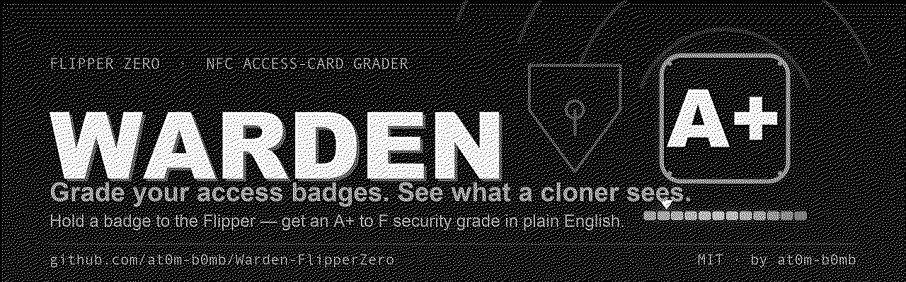
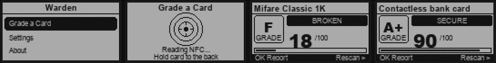
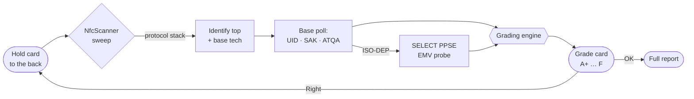

<div align="center">



# Warden

**Grade your access badges. See what a cloner sees.**

Hold your own badge to the Flipper. Warden reads the technology, works out how an attacker would treat it, and hands back a plain-English security grade — **A+ to F** — with a one-tap risk breakdown.

[](https://flipperzero.one/)
[](https://github.com/at0m-b0mb/Warden-FlipperZero/actions)
[](#)
[-2EDC82?style=flat-square)](#)
[](LICENSE)
[](https://github.com/at0m-b0mb)

</div>

---

## The idea

Most people have no idea whether the badge in their wallet is a bank vault or a sticky note. A **Mifare Classic** looks and taps exactly like a **DESFire EV3** — but one is cloned in seconds and the other has no practical attack. Warden closes that gap: one tap, one grade, in words a human understands.

> **Read-only, always.** Warden reads the anticollision/activation response every reader already sees — the UID and card type. It never writes, never runs a key-recovery attack, and never leaves a trace on the card. Your keys stay on your card.

<div align="center">

<br>
<sub><b>Menu → Scan → Grade.</b> A broken Mifare Classic (F) and a contactless bank card (A), side by side. Press OK on any grade for the full breakdown.</sub>
</div>

---

## How Warden grades

The **technology decides the crypto**, so that's what Warden grades. A Mifare Classic is breakable no matter which keys it carries; a DESFire EV2 is sound no matter what it stores. This is exactly how a red-team assessor eyeballs a badge — distilled into a letter and a sentence.

| Card technology | Grade | Band | Why |
|---|:---:|:---:|---|
| **Mifare DESFire** EV1/EV2/EV3 | **A+** | 🟢 Secure | AES-128 with mutual authentication + diversified per-card keys. No practical clone. |
| **Contactless bank card** (EMV) | **A+** | 🟢 Secure | Verified by a live SELECT PPSE probe. Signs a one-time cryptogram per tap — can't be replayed or cloned for contactless. |
| **FeliCa** | **A** | 🟢 Secure | Mutual authentication and encrypted sessions. Backs transit & e-money. |
| **ISO-DEP smartcard** (14443-4A/B) | **A** | 🟢 Secure | Real APDU smartcard (EMV / e-passport / secure-ID family). Runs on-card crypto — no clone at this layer. |
| **Mifare Plus** | **B** | 🟡 Caution | Proper AES at SL3 — but emulates a **broken Classic** at SL1, and you can't see which. |
| **ISO 15693** / iCLASS-class | **D** | 🟠 Weak | Often UID-only; plain ICODE/SLIX memory reads out. Legacy HID iCLASS shares a leaked key. |
| **Mifare Ultralight / NTAG** | **D** | 🟠 Weak | No encryption by default — memory and UID copy onto a magic tag. |
| **ST25TB / SRIx** | **F** | 🟠 Weak | Plain memory tag, no authentication, access keyed on the UID. |
| **ISO 14443-A** (UID only) | **F** | 🔴 Broken | Answers with a serial number and little else. Magic-card clone in one tap. |
| **Mifare Classic** Mini/1K/4K | **F** | 🔴 Broken | Crypto1 broken publicly since 2008 — keys recovered in seconds, then cloned bit-for-bit. |

### The scale

```
A+  90–100   Modern, mutually-authenticated crypto. Trust it.
A   80–89    Strong by design; residual risk is in the backend keys.
B   65–79    Depends on configuration you can't see from outside.
C   50–64    Mixed — verify the deployment before relying on it.
D   35–49    No real crypto; UID-only or open memory.
F    0–34    Trivially cloned or defeated. Treat the door as unlocked.
```

Every grade comes with **findings** you can act on:

```
[x] Crypto1 cipher broken since 2008
[x] Keys recoverable in seconds (nested/darkside)
[!] Often ships on default keys (FFFF.. / A0A1..)
[!] 4-byte UID: copyable to a magic card in one tap
[+] AES-128 with mutual authentication
[i] 7-byte UID (harder to spoof, not secret)
```

---

## What it reads

Warden drives the Flipper's onboard 13.56 MHz radio as a **poller**:



1. **`NfcScanner`** sweeps every supported protocol and reports the full stack on the card (e.g. `ISO14443-3A → ISO14443-4A → MfDesfire`).
2. A short **base-layer poll** (ISO14443-3A/-3B, ISO15693 or FeliCa) pulls the activation data every access system keys on — the **UID**, plus **SAK/ATQA** on the A family.
3. If the card speaks **ISO-DEP**, Warden sends one **`SELECT PPSE`** APDU. A contactless bank card answers `0x9000`, which is how Warden tells an EMV payment card from a generic smartcard. **It selects the payment directory only — it never reads your card number, expiry or CVV.**

Warden reads the same bytes a reader sees at the start of every tap, and nothing more.

---

## Install to your Flipper Zero

Warden is a standard external app (`.fap`) for the **NFC** category. Pick whichever route you like.

### Option A — Prebuilt `.fap` (fastest)

1. Grab `warden.fap` from the [**Releases**](https://github.com/at0m-b0mb/Warden-FlipperZero/releases) page, or from the latest green run under [**Actions**](https://github.com/at0m-b0mb/Warden-FlipperZero/actions) → *Artifacts*.
2. Open [**qFlipper**](https://flipperzero.one/update) and connect your Flipper.
3. Copy `warden.fap` to the SD card at **`SD Card / apps / NFC /`**.
4. On the Flipper: **Apps → NFC → Warden**.

### Option B — Build & install over USB (one command)

With [`ufbt`](https://pypi.org/project/ufbt/) installed and your Flipper plugged in:

```bash
git clone https://github.com/at0m-b0mb/Warden-FlipperZero.git
cd Warden-FlipperZero
ufbt launch          # builds and installs straight onto the Flipper, then opens it
```

### Option C — Custom firmware app catalogs

The source is drop-in compatible with the app-catalog layout used by **Momentum** / **Unleashed** / **RogueMaster**. Drop the folder into `applications_user/warden` and build, or install from their in-firmware app hubs where listed.

> **Compatibility:** built against official firmware **fw 7 / API 87.1**. It uses only public `lib/nfc` APIs, so it tracks current release and dev SDKs.

---

## Using it

- **Grade a Card** — hold your badge flat against the **back** of the Flipper (that's where the antenna is). The moment it's read you get the grade card.
- On the grade card: **OK** opens the full report (findings, UID, SAK/ATQA, protocol stack, and the plain-English verdict). **Right** re-scans another card. **Back** returns to the menu.
- **Settings** — toggle **Sound**, **Vibro** and **LED** feedback. Secure cards get a friendly chirp; broken ones buzz.

---

## Build from source

```bash
# one-time: install the micro Flipper build tool
python3 -m pip install --upgrade ufbt
ufbt update                     # sync the SDK

# from the repo root
ufbt                            # -> dist/warden.fap
ufbt launch                     # build + install + run on a connected Flipper
```

Regenerate the artwork (optional, needs Pillow):

```bash
python3 tools_gen_icons.py      # 10x10 app icon
python3 tools_gen_banner.py     # GitHub banner + social card
python3 tools_gen_mockups.py    # README screen mockups
```

---

## Project layout

```
Warden-FlipperZero/
├─ application.fam            # app manifest (appid, NFC category, icon)
├─ warden.c / warden_i.h      # app lifecycle, views, notifications
├─ helpers/
│  ├─ card_reader.[ch]        # NFC worker: scanner + base-layer poll → CardReading
│  └─ grader.[ch]             # the brain: CardReading → CardGrade (letter, band, findings, verdict)
├─ views/
│  ├─ scan_view.[ch]          # animated "present your badge" reticle
│  └─ result_view.[ch]        # the hero grade card (letter, meter, band)
├─ scenes/                    # start · scan · result · details · settings · about
├─ icons/                     # 1-bit app icon (fbt-compiled)
├─ images/                    # banner, social card, screen mockups
└─ tools_gen_*.py             # Pillow asset generators
```

---

## FAQ

**Does it crack keys or dump memory?** No. Warden is strictly read-only. It doesn't run nested/darkside attacks, doesn't try default keys against sectors, and never writes. The one active step is a single `SELECT PPSE` on ISO-DEP cards to tell a bank card apart from a generic smartcard — that selects the payment *directory* only and reads no card data.

**I graded my credit/debit card and it's an A now — is that right?** Yes. A US contactless card is a **contactless EMV** card: each tap signs a one-time cryptogram, so a captured tap can't be replayed and it can't be cloned for contactless payment. That's genuinely strong, so it grades A / Secure. (Warden flags that your PAN and expiry *can* be skimmed — a privacy caveat — but never the CVV2, and no charge clears without online issuer approval.)

**My Classic shows F but it "works fine" at my office.** That's the point. "Works" and "secure" are different questions — a Classic works *and* clones in seconds. The F is a warning about the second one.

**It says ISO 15693 / D but my card is iCLASS SE.** iCLASS SE and Seos ride the same air interface as weak ICODE tags, so the base read can't always tell them apart. Warden flags the ambiguity in the findings rather than over-promising — check the deployment.

**Why no UID on some cards?** Warden pulls the UID on the ISO14443-A family (Classic, DESFire, Ultralight/NTAG, Plus, ISO-DEP-A — the bulk of access badges). Other air interfaces are still graded by technology; the UID readout for those is on the roadmap.

---

## Ethics & legal

Warden is a **defensive** tool: know your own doors before someone else does. Only grade cards you **own or are explicitly authorised to assess**. It performs no attack and stores no card data — but you are responsible for using it lawfully. Don't be a jerk.

---

## Credits

Built by **[at0m-b0mb](https://github.com/at0m-b0mb)**. Part of a family of Flipper Zero security tools:

- 🛰️ **[Argus](https://github.com/at0m-b0mb/Argus-FlipperZero)** — Wi-Fi deauth / evil-twin detector
- 👻 **[Specter](https://github.com/at0m-b0mb/Specter-FlipperZero)** — passive NFC reader/skimmer bug-sweep
- 📡 **[Cerberus](https://github.com/at0m-b0mb/flipper-cerberus)** — Sub-GHz RF watchdog
- 🏷️ **[GhostTag](https://github.com/at0m-b0mb/GhostTag-FlipperZero)** — anti-stalking BLE tracker hunter

<div align="center">
<sub>MIT © 2026 at0m-b0mb — Flipper Zero and the dolphin are trademarks of Flipper Devices. Warden is an independent project.</sub>
</div>
