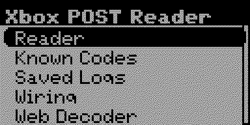
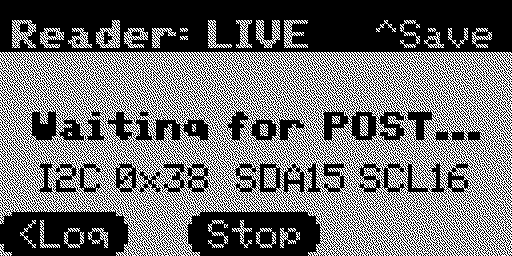
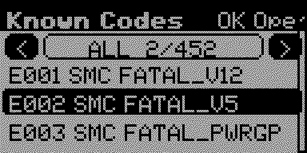
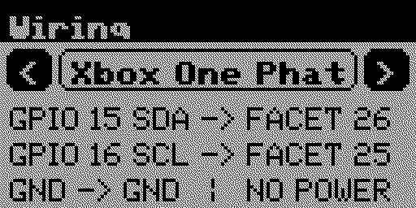
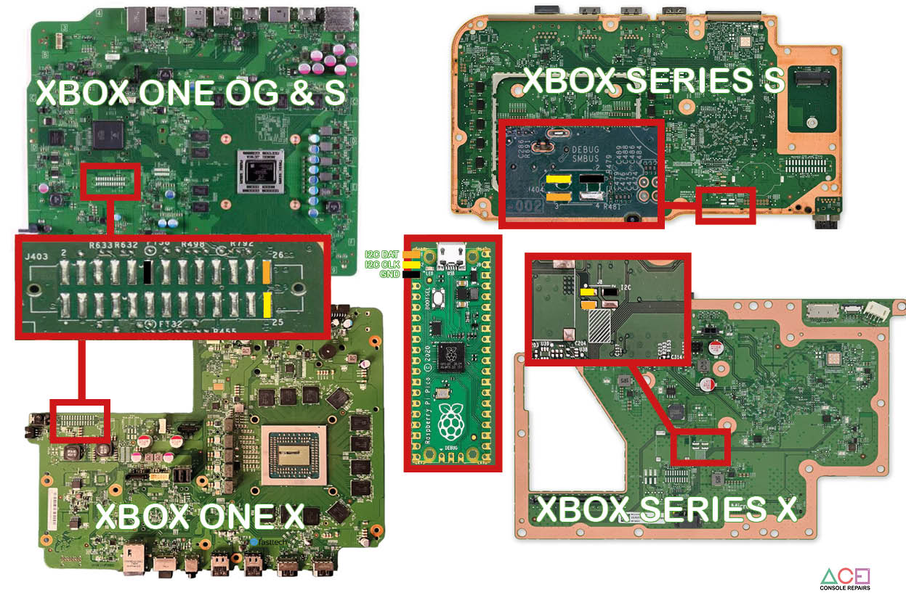

# Xbox POST Code Reader for Flipper Zero

Xbox POST Code Reader turns a Flipper Zero into a portable Xbox boot diagnostic
reader. It captures POST traffic directly from a supported Xbox motherboard,
keeps a live history, decodes known codes offline, saves sessions to the SD
card, and can stream codes over USB to the companion browser tool.

This is a Flipper Zero adaptation of the PicoDurangoPOST project, paired
with the online
[WebXboxPOSTTool](https://demo.coolshrimpmodz.com/WebXboxPOSTTool/).

> [!IMPORTANT]
> This is experimental repair hardware. Confirm the connector orientation and
> bus voltage for the exact motherboard revision before connecting a Flipper.

## What it can do

- Emulate the MAX6958 POST display at I2C address `0x38`.
- Capture four-digit POST codes without blocking the Flipper controls.
- Show either one current code or a scrolling 128-entry live log.
- Decode selected codes locally using 452 bundled console-aware records.
- Browse known codes by All, POST, Error, SMC, SP, CPU, or OS category.
- Save captures as automatically numbered SD-card logs.
- Browse and read saved logs from the Flipper.
- Stream live codes to WebXboxPOSTTool over USB Web Serial.
- Show Xbox One and Xbox Series wiring directly in the app.
- Display an offline QR code for opening the decoder on a phone.

## Screenshots

Captured from the Flipper simulator because the app enters USB UART mode during
live capture, which prevents on-device screenshots.

| Main Menu | Reader | Known Codes | Wiring |
| --- | --- | --- | --- |
|  |  |  |  |

## Install the FAP

1. Download `xbox_postcode_reader.fap` from `dist/` or from the
   [WebXboxPOSTTool reader setup page](https://demo.coolshrimpmodz.com/WebXboxPOSTTool/).
2. Connect the Flipper Zero with qFlipper or another SD-card file manager.
3. Copy the FAP to `SD Card/apps/GPIO/xbox_postcode_reader.fap`.
4. On the Flipper, open **Apps > GPIO > Xbox POST Code Reader**.

The app is currently version **0.14**.

## Wiring

Only connect SDA, SCL, and a shared ground.

| Signal | Xbox One family (FACET) | Xbox Series S/X (AARDVARK) | Flipper Zero |
| --- | --- | --- | --- |
| SDA | Pin 26 | Pin 3 | GPIO 15 / PC1 |
| SCL | Pin 25 | Pin 1 | GPIO 16 / PC0 |
| GND | GND | GND | GND |

> [!CAUTION]
> Do not connect a Flipper power pin to the Xbox POST header and do not power
> the motherboard from the Flipper. Connect wiring with the console unplugged.
> Confirm the bus is compatible with 3.3 V GPIO and use level shifting when
> required.

Xbox One, One S, and One X use the FACET connection. Xbox Series S and Series X
use AARDVARK. Connector orientation and populated components can vary between
motherboard revisions, so locate pin 1 from the board markings before soldering.



## Read POST codes

1. Connect SDA, SCL, and GND with the Xbox unplugged.
2. Open **Wiring** and use Left/Right to select the Xbox model. Confirm the
   displayed pins.
3. Return to the menu and open **Reader**. Capture starts automatically.
4. Apply standby power or start the Xbox.
5. Watch the current code, source (`SMC`, `SP`, `CPU`, or `OS`), segment, and
   elapsed time.
6. Press Right to decode the selected code locally, or Left to open the rolling
   log.
7. Press OK to pause capture before changing wiring.

A lack of traffic can also indicate missing standby power or a failed standby
rail; it does not always mean the reader is wired incorrectly.

## Controls

### Reader

| Button | Action |
| --- | --- |
| OK | Pause or resume capture |
| Up / Down | Browse captured codes |
| Hold Up | Save the complete history to the next numbered SD log |
| Left | Open the rolling live log |
| Right | Decode the selected code |
| Hold Left | Open the Clear History confirmation |
| Back | Return from Decode or Log; from Reader, stop capture and open the menu |

On the Decode screen, Up/Down scrolls repair notes, Right changes the selected
Xbox model, and Back returns to the Reader screen.

### Known Codes

- Left/Right changes the category.
- Up/Down browses records.
- OK opens the highlighted record.
- Up/Down scrolls long repair information.
- Back returns to the list, then to the main menu.

### Saved Logs

Hold Up while the Reader or live log contains codes. The app creates
`post_log_001.txt`, `post_log_002.txt`, and so on without overwriting an earlier
capture. Open **Saved Logs**, choose a file with Up/Down, press OK, and scroll
with Up/Down.

Logs are stored in the app data directory under `logs/`.

## Pair the FAP with WebXboxPOSTTool

The browser tool can receive the Flipper's codes live over USB:

**[Open WebXboxPOSTTool](https://demo.coolshrimpmodz.com/WebXboxPOSTTool/)**

1. Use desktop Chrome, Edge, or Opera. Web Serial is not available in every
   browser or on most mobile browsers.
2. Launch **Xbox POST Code Reader** on the Flipper.
3. Connect the Flipper to the computer by USB.
4. Open WebXboxPOSTTool and select **Connect POST Reader**.
5. Choose the Flipper serial device in the browser permission dialog.
6. Start the Xbox. Codes will appear in the POST Code Monitor and can be
   selected for local database details.

The page opens the device at `115200` baud and automatically sends discovery
commands. A successful connection reports information similar to:

```text
DEVICE: Xbox POST Code Reader
FW: Xbox POST Code Reader v0.14
CONFIG: console=SERIES X database=452 mode=POST
```

Supported discovery commands are:

| Command | Response |
| --- | --- |
| `hello` | Device identity, firmware, and configuration |
| `version` | FAP version |
| `config` | Selected console, database size, and capture mode |

The selected console follows the model chosen in the Flipper's Wiring or Decode
screen. The website also contains the full searchable master database and works
without a connected reader for manual lookups.

For phone use, open the same URL manually or scan the QR code shown under
**Web Decoder** in the FAP. The phone page can browse and decode codes, but USB
Web Serial generally requires a supported desktop browser.

## App menu

```text
Xbox POST Reader
|-- Reader
|-- Known Codes
|-- Saved Logs
|-- Wiring
|-- Web Decoder
`-- About
```

POST capture, USB transmission, and button input use separate queues. Heavy
POST traffic therefore cannot fill the input queue and lock menu navigation.

## Local database

The FAP bundles 452 POST records maintained from:

- [`XboxOneResearch/errorcodes`](https://github.com/XboxOneResearch/errorcodes)
- [`TorusHyperV/XboxOne-EXXX-err-Codes`](https://github.com/TorusHyperV/XboxOne-EXXX-err-Codes)

The database includes exact SMC, SP, CPU, and OS errors, normal boot markers,
masked boot phases, and AGESA/ABL test points. See
[`data/SOURCES.md`](data/SOURCES.md) for snapshot details.

To regenerate the Flipper and browser databases after updating the source
snapshots:

```powershell
python tools/generate_databases.py --site-dir W:\Demo\WebXboxPOSTTool
```

## Build from source

With [uFBT](https://github.com/flipperdevices/flipperzero-ufbt) installed:

```sh
ufbt
```

The release FAP is written to `dist/xbox_postcode_reader.fap`.

From a full Flipper firmware tree, place this directory at
`applications_user/xbox_postcode_reader` and run:

```sh
./fbt fap_xbox_postcode_reader
```

## Project layout

```text
.
|-- application.fam             Flipper external-app manifest
|-- main.c                      Capture, UI, USB serial, logs, and QR
|-- postcode_db.c               Generated offline database
|-- postcode_db.h               Database interface
|-- xbox_postcode_reader.png    10x10 application icon
|-- assets/                     Editable monochrome icon source
|-- data/                       Archived upstream database snapshots
|-- tools/                      Database generator
|-- dist/                       Built FAP
|-- CHANGELOG.md
`-- README.md
```

## Credits

- Flipper Zero adaptation and WebXboxPOSTTool: [coolshrimp](https://github.com/coolshrimp)
- Adapted from the PicoDurangoPOST project by XboxOneResearch

Use this project only on hardware you own or are authorized to repair. Xbox and
related names are trademarks of Microsoft. This independent community project
is not affiliated with or endorsed by Microsoft or Flipper Devices.
